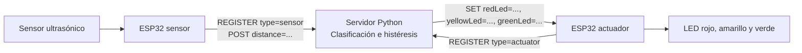

# Funcionamiento del sistema IoT distribuido

Este documento describe el código vigente. El sistema utiliza dos ESP32 y una computadora: una placa mide la distancia, la otra controla los LEDs y el servidor Python decide qué luces encender.

El código propio usa nombres y mensajes en español, sin comentarios explicativos. Se conservan las palabras del protocolo original y los nombres exigidos por Arduino, Python y PlatformIO, como `REGISTER`, `distance`, `setup()` y `loop()`, para mantener la compatibilidad.

## 1. Arquitectura



Cada ESP32 mantiene su propia conexión TCP con la computadora. La comunicación utiliza texto UTF-8 y cada mensaje termina con `\n`.

La clasificación se ejecuta en el servidor. Se retiraron `ClasificadorDistancia.h` y `ClasificadorDistancia.cpp` del cliente porque duplicaban esa responsabilidad. El sensor valida físicamente la medición y el actuador interpreta órdenes de luces.

## 2. Archivos

| Archivo | Responsabilidad |
| --- | --- |
| `src/cliente/main.cpp` | Programa del sensor: inicializa, mide y publica lecturas. |
| `src/cliente/PrincipalActuador.cpp` | Programa del actuador: recibe órdenes y actualiza LEDs. |
| `src/cliente/ClienteTCP.h/.cpp` | Wi-Fi, TCP, registro, reconexión y separación de mensajes. Compartido por ambos firmwares. |
| `src/cliente/ConfigRed.h` | Credenciales, direcciones, puerto y tiempos de reintento. |
| `src/cliente/Config.h` | Pines, límites físicos, tiempos y tamaño máximo de mensaje. |
| `src/cliente/LecturaDistancia.h` | Datos `distanciaCm` y `valida`. Una lectura comienza como inválida. |
| `src/cliente/SensorUltrasonico.h/.cpp` | Disparo, lectura del eco y conversión a centímetros. |
| `src/cliente/IndicadorLeds.h/.cpp` | Validación de `SET`, encendido, apagado y parpadeo. |
| `src/servidor/server.py` | Servidor, clasificación, histéresis y distribución de órdenes. |
| `platformio.ini` | Entornos `sensor` y `actuador`, para ESP32 con Arduino. |
| `pruebas/test_servidor.py` | Pruebas de clasificación y comunicación TCP local real. |
| `pruebas/prueba_cliente.cpp` | Pruebas de sensor y LEDs con hardware simulado. |
| `pruebas/soporte/Arduino.h` | Interfaz de hardware usada exclusivamente en las pruebas nativas. |

Los filtros de PlatformIO seleccionan el programa y los módulos de cada placa. Así, no se compilan dos `setup()` ni dos `loop()` dentro de un mismo firmware. La interfaz de pruebas no se incluye en los programas de las placas.

## 3. Configuración

### Red

Completar `SSID_WIFI` y `CLAVE_WIFI` en `src/cliente/ConfigRed.h`. Si el nombre de la red está vacío, el cliente avisa por el monitor serie y no inicia la conexión.

| Elemento | Valor inicial |
| --- | --- |
| Router / puerta de enlace | `192.168.0.1` |
| ESP32 actuador | `192.168.0.100` |
| ESP32 sensor | `192.168.0.101` |
| Computadora con el servidor | `192.168.0.102` |
| Máscara de red | `255.255.255.0` |
| Puerto TCP | `5000` |

Las direcciones siguen el diagrama del proyecto, pero deben ajustarse a la red real. El programa no asigna la IP de la computadora: `IP_SERVIDOR` debe coincidir con la que tenga el equipo que ejecuta Python. Las IP fijas de las placas deben estar disponibles.

Con `USAR_IP_FIJA = true`, cada firmware usa su dirección correspondiente. Con `false`, el router asigna la IP del ESP32 por DHCP; el destino del servidor sigue siendo `IP_SERVIDOR`.

El servidor escucha en `0.0.0.0:5000`. Esto significa que acepta conexiones por las interfaces de la computadora; `0.0.0.0` no se usa como destino en los ESP32.

### Pines

| Placa | Señal | GPIO |
| --- | --- | --- |
| Sensor | Disparo TRIG | 25 |
| Sensor | Eco ECHO | 26 |
| Actuador | LED rojo | 27 |
| Actuador | LED amarillo | 32 |
| Actuador | LED verde | 33 |

Los pines están en `Config.h`. El indicador considera `HIGH` como encendido y `LOW` como apagado.

## 4. Protocolo

### Registro

El primer mensaje de cada conexión identifica la placa:

```text
REGISTER type=sensor
REGISTER type=actuator
```

Cada placa envía únicamente su propio tipo. El servidor no envía confirmación del registro. TCP conserva el orden, por lo que el sensor puede publicar una lectura inmediatamente después.

El cliente debe registrarse en un máximo de cinco segundos y no puede cambiar de función dentro de la misma conexión. Una reconexión requiere un registro nuevo.

### Mediciones

```text
POST distance=15.27
POST distance=245.10
POST distance=invalida
```

La distancia está en centímetros, con punto decimal y dos decimales. `invalida` comunica ausencia de eco o una medición fuera del alcance físico del sensor. El servidor trata cualquier distancia no numérica, `NaN` o infinito como error.

Una lectura física válida mayor a 200 cm se envía como número. El servidor aplica su límite de trabajo y apaga las luces. Esto permite reemplazar un estado anterior incluso cuando la lectura nueva es inválida o está fuera de rango.

### Órdenes de luces

```text
SET redLed=on, yellowLed=off, greenLed=off
SET redLed=off, yellowLed=on, greenLed=off
SET redLed=off, yellowLed=off, greenLed=off
```

Cada orden debe incluir los tres campos, sin repeticiones. Se admiten espacios alrededor de las comas y de `=`, así como otro orden de los campos. Los nombres y valores deben respetar las mayúsculas y minúsculas del protocolo mostrado.

| Valor | Efecto |
| --- | --- |
| `on` | Encendido permanente. |
| `off` | Apagado. |
| `blink_2` | Dos ciclos por segundo; cambia de nivel cada 250 ms. |
| `blink_4` | Cuatro ciclos por segundo; cambia de nivel cada 125 ms. |

El servidor mantiene las reglas originales de luces fijas. El actuador también admite los parpadeos; se pueden solicitar cambiando los valores de `LEDS_POR_RANGO` en el servidor.

### Líneas y tamaño

Cada mensaje transmitido termina en `\n`; también se acepta `\r\n`. TCP puede entregar una línea en fragmentos o varias líneas juntas. Ambos extremos conservan los fragmentos pendientes y procesan solamente las líneas completas.

El máximo es de 192 bytes antes de `\n`, incluido el eventual `\r`. Una trama demasiado larga o con un byte nulo cierra la conexión. Este protocolo utiliza TCP directamente; `POST` no es una petición HTTP.

## 5. Programa del sensor

`setup()` inicia el monitor serie a 115200 baudios, prepara los pines y comienza la conexión Wi-Fi.

`loop()` mantiene la conexión y mide cuando transcurren 100 ms desde el inicio de la medición anterior. `SensorUltrasonico::medirDistanciaCm()`:

1. Mantiene TRIG en bajo durante 2 microsegundos.
2. Lo activa durante 10 microsegundos y vuelve a desactivarlo.
3. Espera el pulso ECHO por un máximo de 30000 microsegundos.
4. Calcula `distanciaCm = duracionUs × 0.0343 / 2`.
5. Marca la lectura como válida si está entre 2 y 400 cm.

La división entre dos corresponde al recorrido de ida y vuelta del sonido. La ausencia de eco se comunica como lectura inválida, sin inventar una distancia.

El rango físico del sensor es de 2–400 cm, mientras que el rango de trabajo aplicado por el servidor es de 2–200 cm. Son validaciones con responsabilidades distintas.

Los 100 ms son el intervalo nominal. Las operaciones de red y la espera del eco pueden aumentarlo. Si no hay conexión, se muestra la lectura por el monitor serie y se descarta; al reconectar se envían mediciones actuales.

## 6. Módulo de conexión

`ClienteTCP` recibe el tipo y la dirección local correspondientes a cada placa.

| Método | Funcionamiento |
| --- | --- |
| `iniciar()` | Configura la red y comienza Wi-Fi. Si faltan credenciales o falla la configuración de la IP, deja la conexión sin iniciar e informa el motivo. |
| `actualizar()` | Reintenta Wi-Fi cada cinco segundos y TCP cada tres segundos. El intento TCP tiene un límite de un segundo. Al conectar envía el registro y devuelve `true`. |
| `estaConectado()` | Comprueba que exista configuración, Wi-Fi y conexión TCP. |
| `enviarLinea()` | Añade el salto de línea y verifica que se enviaron todos los bytes. Un envío incompleto cierra el socket. |
| `recibirLinea()` | Lee los bytes disponibles sin esperar a que se complete una línea; conserva fragmentos entre llamadas. |
| `desconectar()` | Cierra el socket y descarta fragmentos de la sesión anterior. |

El sensor no envía lecturas antes de transmitir su registro en cada nueva conexión.

## 7. Servidor y clasificación

`ServidorTCP.iniciar()` abre el puerto, acepta conexiones y crea un hilo de atención por cliente. El bucle principal revisa también la vigencia de la última lectura.

`atender()` reconstruye las líneas. `procesar()` interpreta el comando y llama a `registrar_cliente()` o `recibir_distancia()`. Solo los clientes registrados como sensores pueden publicar distancias.

Un bloqueo protege la lista de clientes y el estado compartido. La clasificación y el envío de la orden se realizan en orden, evitando que un registro tardío reciba un estado antiguo después de uno más reciente.

### Límites base

| Condición | Rango | Salida |
| --- | --- | --- |
| Inválida, menor que 2 cm o mayor que 200 cm | ERROR | Todas apagadas. |
| 2 cm ≤ distancia < 20 cm | CERCANO | Rojo encendido. |
| 20 cm ≤ distancia < 40 cm | MEDIO | Amarillo encendido. |
| 40 cm ≤ distancia ≤ 200 cm | LEJANO | Verde encendido. |

### Histéresis de 2 cm

| Rango anterior | Transición |
| --- | --- |
| CERCANO | Se mantiene por debajo de 22 cm. Desde 22 cm vuelve a clasificar por los límites base. |
| MEDIO | Cambia a CERCANO por debajo de 18 cm y a LEJANO desde 42 cm. |
| LEJANO | Se mantiene desde 38 cm. Por debajo de 38 cm vuelve a clasificar por los límites base. |
| ERROR | La siguiente lectura válida utiliza los límites base de 20 y 40 cm. |

Un cambio grande puede saltar directamente del rango cercano al lejano o viceversa. La validación del rango de trabajo ocurre antes de la histéresis.

El servidor conserva la histéresis por sensor y envía cada orden a todos los actuadores. El montaje previsto usa un sensor; si se conectan varios, la última lectura recibida controla las luces, sin promediar sensores.

Un actuador que se registra recibe inmediatamente el último estado vigente, o todas las luces apagadas si no hay una lectura vigente. `detener()` cierra la escucha y las conexiones; el programa termina sus hilos de atención.

## 8. Programa del actuador

`PrincipalActuador.cpp` inicia las luces apagadas y se registra como `actuator`.

Su `loop()` comprueba la conexión, procesa hasta ocho líneas completas y actualiza los parpadeos. Ese límite evita que muchos mensajes pendientes impidan atender las luces.

`IndicadorLeds::procesarComando()` valida toda la orden antes de modificar una salida. Rechaza campos ausentes, repetidos o desconocidos y modos no reconocidos. Ante una orden inválida, el programa principal apaga las luces.

`configurar()` establece el modo de cada LED. `actualizar()` calcula los cambios necesarios usando `millis()`, sin pausas largas. Recibir repetidamente el mismo modo no reinicia la fase del parpadeo. El cálculo tolera el desbordamiento del reloj de 32 bits. `apagarTodos()` cancela los modos y deja las tres salidas en bajo.

## 9. Fallos y recuperación

| Situación | Respuesta |
| --- | --- |
| Medición inválida o fuera de 2–200 cm | El servidor envía apagado y reinicia la histéresis de ese sensor. |
| Se desconecta el sensor que controla el estado vigente | El servidor invalida la lectura y envía apagado. |
| Transcurren tres segundos sin lecturas nuevas | El servidor invalida el estado. La revisión es periódica, aproximadamente cada 200 ms sin conexiones nuevas. |
| El actuador pierde Wi-Fi o TCP | Apaga sus salidas y vuelve a intentar conectarse. |
| El actuador pasa tres segundos sin una orden válida | Apaga sus salidas y cierra el socket para reconectar, aunque la conexión todavía parezca activa. |
| Se reinicia el servidor | Las placas vuelven a conectarse y registrarse. |
| Llegan lecturas nuevas después de una interrupción | Se retoma la clasificación y la aplicación de las órdenes. |

Sin un sensor que publique, el actuador puede reconectarse cada tres segundos y recibe nuevamente la orden de apagado. Esta medida también permite recuperar una conexión silenciosa después de una caída de la computadora.

No se guardan mediciones para enviarlas más tarde ni se mantiene indefinidamente una luz a partir de un dato antiguo.

## 10. Compilación, carga y ejecución

Abrir la carpeta raíz `Proyecto_2_IOT` como proyecto de PlatformIO. `WiFi.h` pertenece al framework Arduino para ESP32, resuelto por la configuración del proyecto.

Compilar ambos firmwares:

```powershell
pio run
```

Compilar cada uno por separado:

```powershell
pio run -e sensor
pio run -e actuador
```

Cargar el firmware en cada placa, sustituyendo los puertos de ejemplo por los reales:

```powershell
pio run -e sensor -t upload --upload-port COM3
pio run -e actuador -t upload --upload-port COM4
```

Abrir el monitor de una placa:

```powershell
pio device monitor --port COM3 --baud 115200
```

Cerrar el monitor antes de volver a cargar por ese puerto.

Ejecutar el servidor desde la raíz del proyecto:

```powershell
python src/servidor/server.py
```

Para indicar interfaz y puerto:

```powershell
python src/servidor/server.py --direccion 0.0.0.0 --puerto 5000
```

Se mantienen `--host` y `--port` como alias. El puerto debe coincidir con `PUERTO_SERVIDOR`. Python utiliza únicamente su biblioteca estándar.

Si los ESP32 no conectan, comprobar IP real de la computadora, puerto, red local y permiso de entrada del servidor en el firewall. Detener el servidor con `Ctrl+C`. Las placas pueden encenderse antes del servidor y conectarse mediante sus reintentos.

## 11. Pruebas y alcance de la verificación

Ejecutar las pruebas del servidor:

```powershell
python -m unittest discover -s pruebas -p "test_*.py" -v
```

Las 12 pruebas cubren límites, histéresis, datos inválidos, fragmentación y agrupación de mensajes, registro tardío, desconexión, caducidad de lecturas, roles y tamaño de mensajes. Usan sockets TCP locales reales y no requieren placas.

Compilar y ejecutar las pruebas del cliente con g++:

```powershell
New-Item -ItemType Directory -Force -Path .pio/pruebas | Out-Null
g++ -std=c++11 -Wall -Wextra -Werror -I pruebas/soporte -I src/cliente pruebas/prueba_cliente.cpp src/cliente/IndicadorLeds.cpp src/cliente/SensorUltrasonico.cpp -o .pio/pruebas/cliente.exe
./.pio/pruebas/cliente.exe
```

Las 44 comprobaciones utilizan los módulos reales del sensor y del indicador, con eco, tiempo y GPIO simulados. Cubren conversión, límites físicos, validación de órdenes, cambios parciales, frecuencias de parpadeo, comandos repetidos y desbordamiento del reloj.

Se verificaron ambas compilaciones ESP32, las 12 pruebas de Python y las 44 comprobaciones nativas. No se cargó el nuevo firmware en las placas ni se realizó una prueba física del montaje.

## 12. Informe anterior

`doc/informe.md` conserva el informe inicial de la versión con una sola placa. Sus diagramas, fragmentos de código, comandos y resultados experimentales describen esa versión histórica.

Este documento contiene la arquitectura y las instrucciones vigentes. Las mediciones físicas del informe anterior no constituyen una validación del nuevo firmware.
