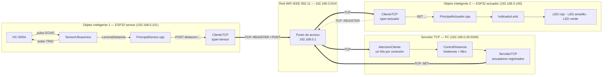
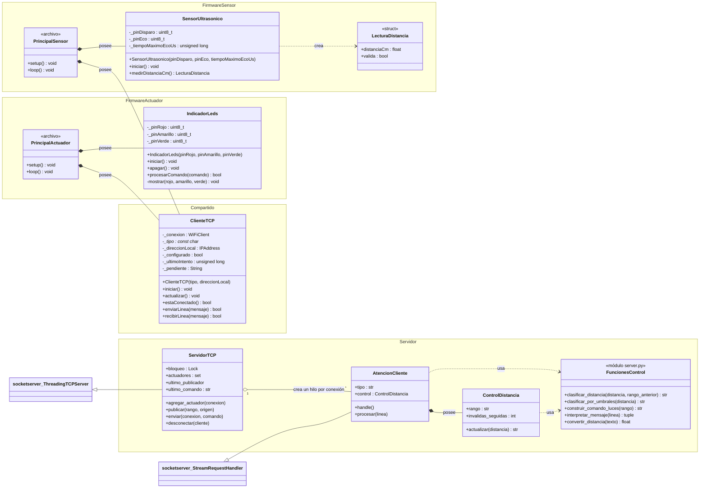
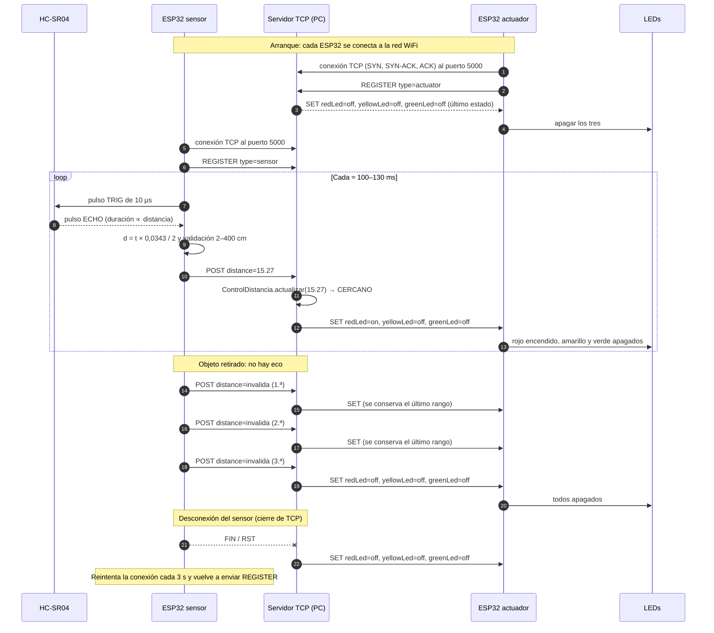
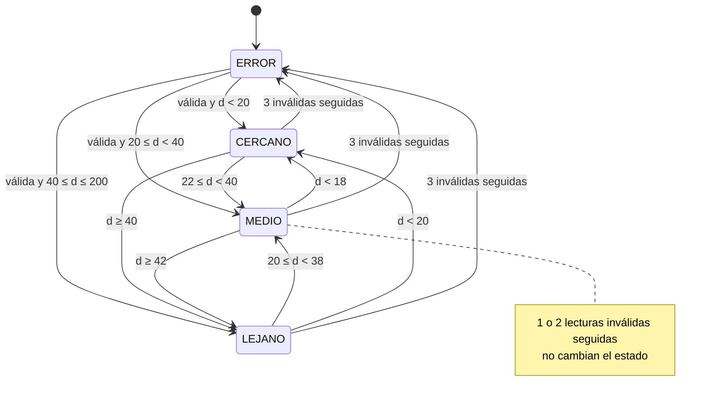
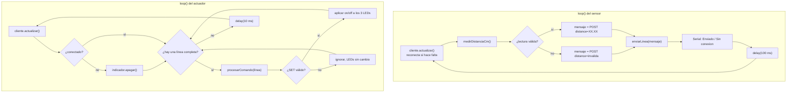

# Informe Técnico — Práctica 2: Integración de Objetos Inteligentes con TCP/IP

| | |
| --- | --- |
| **Asignatura** | Internet de las Cosas [SIS-234] — 2-2026 |
| **Carrera** | Ingeniería de Sistemas |
| **Actividad** | Integración de objetos inteligentes con TCP/IP |
| **Repositorio** | https://github.com/Alous12/Proyecto_2_IOT |
| **Fecha** | Octubre de 2026 |

**Integrantes**

| Integrante | Cuenta de GitHub | Responsabilidad principal |
| --- | --- | --- |
| Alejandro Machaca | `alous12` | _Completar_ |
| Rubén Cordero | _Completar_ (autor de commits: Rubén Cordero) | _Completar_ |
| Luciana Leaño | `lucianaaaaaaa` | _Completar_ |

El trabajo se organizó en ramas por módulo (`Sensor`, `leds` y `server`), que luego se integraron en `main`. El historial de commits de cada rama respalda el aporte individual.

> **Observaciones de la Práctica 1:** el [Anexo E](#anexo-e--atención-a-las-observaciones-de-la-revisión-de-la-práctica-1) detalla cómo se atendió cada observación de la revisión anterior y dónde verificarlo.

---

## Contenido

1. [Requerimientos Funcionales y No Funcionales](#1-requerimientos-funcionales-y-no-funcionales)
2. [Análisis y Diseño](#2-análisis-y-diseño)
3. [Desarrollo e Implementación](#3-desarrollo-e-implementación)
4. [Pruebas y Validaciones](#4-pruebas-y-validaciones)
5. [Resultados](#5-resultados)
6. [Conclusiones](#6-conclusiones)
7. [Recomendaciones](#7-recomendaciones)
8. [Anexos](#8-anexos)

---

# 1. Requerimientos Funcionales y No Funcionales

El sistema es distribuido y tiene tres nodos conectados a la misma red WiFi (IEEE 802.11):

- **Objeto inteligente sensor:** un ESP32 con un sensor ultrasónico HC-SR04. Mide la distancia y la envía al servidor.
- **Servidor TCP:** un programa Python que corre en una PC. Recibe las distancias, ejecuta el algoritmo de control y decide qué LED debe encenderse.
- **Objeto inteligente actuador:** un ESP32 con tres LEDs (rojo, amarillo y verde). Ejecuta las órdenes del servidor.

Los objetos no se comunican directamente entre sí: toda la información pasa por el servidor. El actuador no conoce los rangos de distancia y el sensor no conoce los LEDs; la decisión está concentrada en un solo lugar.

## 1.1 Requerimientos funcionales

RF1 a RF4 son los exigidos por la práctica. RF5 a RF9 son requerimientos que el grupo agregó para que el sistema distribuido sea robusto ante fallas de red, de sensor y de protocolo.

| ID | Requerimiento | Criterio de aceptación |
| --- | --- | --- |
| **RF1** | El objeto sensor debe medir la distancia entre el HC-SR04 y un objeto. | Cada medición produce una distancia en centímetros y un indicador de validez. La ausencia de eco y las distancias fuera de 2–400 cm se reportan como `invalida`. |
| **RF2** | El servidor debe clasificar la distancia en tres rangos contiguos y sin solapamiento, con histéresis. | Toda lectura válida entre 2 y 200 cm produce exactamente uno de `CERCANO`, `MEDIO` o `LEJANO`. Las transiciones respetan el margen de histéresis de 2 cm (§1.1.2). |
| **RF3** | El objeto actuador debe activar un LED distinto según el rango. | `CERCANO` → solo rojo; `MEDIO` → solo amarillo; `LEJANO` → solo verde; `ERROR` → los tres apagados. Nunca hay más de un LED encendido. |
| **RF4** | Las lecturas y los comandos deben viajar por sockets TCP sobre WiFi, con un protocolo de aplicación propio. | El sensor envía `POST` al servidor y el servidor envía `SET` al actuador por TCP, puerto 5000, con el formato de §2.6. |
| **RF5** | Cada cliente debe identificarse al conectarse, y el servidor debe sincronizar a los actuadores. | Cada cliente envía `REGISTER type=sensor` o `REGISTER type=actuator`. Solo se aceptan `POST` de clientes registrados como sensor. Un actuador que se registra recibe de inmediato el último estado conocido. |
| **RF6** | El sistema debe tolerar lecturas inválidas aisladas del sensor. | Una o dos lecturas inválidas seguidas no cambian el estado de los LEDs. A la tercera lectura inválida consecutiva el rango pasa a `ERROR`. |
| **RF7** | El sistema debe tener un comportamiento de fallo seguro. | Si el sensor que publicó el último dato se desconecta, el servidor ordena apagar los LEDs. Si el actuador pierde la conexión con el servidor, apaga sus LEDs por sí mismo. |
| **RF8** | Los clientes deben reconectarse automáticamente. | Si se pierde el WiFi o el servidor, cada ESP32 reintenta la conexión TCP cada 3 s y se vuelve a registrar sin intervención manual. |
| **RF9** | El protocolo debe rechazar mensajes inválidos sin afectar al sistema. | El servidor ignora mensajes desconocidos y cierra las conexiones con líneas de más de 192 caracteres. El actuador ignora un `SET` mal formado y conserva el estado actual de los LEDs. |

### 1.1.1 Rangos y lógica de control

El rango de trabajo es de **2 a 200 cm**, con ambos límites incluidos.

| Distancia o condición | Rango lógico | Comando enviado al actuador | LEDs |
| --- | --- | --- | --- |
| 3 lecturas inválidas seguidas (sin eco, < 2 cm, > 200 cm o valor no numérico) | `ERROR` | `SET redLed=off, yellowLed=off, greenLed=off` | Todos apagados |
| 2 cm ≤ d < 20 cm | `CERCANO` | `SET redLed=on, yellowLed=off, greenLed=off` | Rojo |
| 20 cm ≤ d < 40 cm | `MEDIO` | `SET redLed=off, yellowLed=on, greenLed=off` | Amarillo |
| 40 cm ≤ d ≤ 200 cm | `LEJANO` | `SET redLed=off, yellowLed=off, greenLed=on` | Verde |

Los intervalos son contiguos y no se solapan: los valores exactos de 20 y 40 cm pertenecen al rango superior.

### 1.1.2 Histéresis

Para evitar el parpadeo cuando el objeto está justo sobre un límite, se usa un margen de **2 cm**. La histéresis no crea un cuarto rango; solo define cuándo se confirma una transición:

| Rango actual | Se mantiene mientras | Cambia cuando |
| --- | --- | --- |
| `CERCANO` | d < 22 cm | d ≥ 22 cm → se reclasifica con los límites base |
| `MEDIO` | 18 cm ≤ d < 42 cm | d < 18 cm → `CERCANO`; d ≥ 42 cm → `LEJANO` |
| `LEJANO` | d ≥ 38 cm | d < 38 cm → se reclasifica con los límites base |
| `ERROR` | — | La siguiente lectura válida se clasifica directamente con 20 y 40 cm |

### 1.1.3 Filtro de lecturas inválidas (mejora respecto a la Práctica 1)

En la Práctica 1, una sola lectura inválida llevaba el sistema a `ERROR`, y la lectura siguiente se clasificaba **sin histéresis**. Esa es la causa más probable de la falla H04 (oscilación amarillo/verde cerca de 40 cm). En esta versión, una lectura inválida solo cambia el rango si se repite **3 veces seguidas**. Mientras tanto se conserva el último rango válido, y con él la memoria de la histéresis. Cualquier lectura válida reinicia el conteo. A 10 lecturas por segundo, el sistema tarda unos 0,3 s en pasar a `ERROR`.

## 1.2 Requerimientos no funcionales

Los valores son objetivos medibles. Su verificación está en la sección 4.

| ID | Atributo | Requerimiento medible | Forma de verificación |
| --- | --- | --- | --- |
| **RNF1** | Estabilidad | El sistema completo opera **≥ 10 min** continuos sin reinicios, bloqueos ni desconexiones permanentes. | Prueba cronometrada del sistema completo (PH-09) y prueba de 10 min del servidor (PS-04). |
| **RNF2** | Exactitud | Error individual **≤ ±3 cm** frente a una cinta métrica, en 10–200 cm. | 10 lecturas por punto en 8 distancias (PH-03). |
| **RNF3** | Tiempo de respuesta | El LED refleja un cambio de rango en **≤ 1 s**, medido de extremo a extremo (sensor → servidor → actuador). | Medición con video y registro temporal (PH-07). |
| **RNF4** | Frecuencia de muestreo | **≥ 2 lecturas/s** recibidas por el servidor (valor de diseño: ≈ 7–10 lecturas/s). | Conteo de mensajes en un intervalo conocido (PH-06). |
| **RNF5** | Latencia del servidor | Procesamiento `POST` → `SET` **≤ 50 ms en el percentil 99**. | Medición automatizada de 10 min (PS-04). |
| **RNF6** | Recuperación | Tras restablecer el servidor, ambos clientes se reconectan y el sistema vuelve a operar en **≤ 10 s**. | Prueba de reinicio del servidor (PH-08). |
| **RNF7** | Detección de fallos | Los LEDs se apagan en **≤ 1 s** después de perder el objeto (lecturas inválidas) o de desconectarse el sensor de forma ordenada. | Pruebas PS-05 y PH-08. |
| **RNF8** | Seguridad eléctrica | Ninguna entrada del ESP32 recibe más de su máximo absoluto (**≤ 3,6 V**), y la corriente de cada LED es **≤ 12 mA**. | Análisis de niveles (§2.3), cálculo de corriente y medición con multímetro (PH-01). |
| **RNF9** | Calidad del código | Código modular (POO), documentado y conforme a las convenciones; compila **sin advertencias**. | Compilación, pruebas automatizadas y revisión estática (PS-01, PS-02, PS-06). |
| **RNF10** | Uso de recursos | Cada firmware usa **≤ 25 % de RAM** y **≤ 70 % de flash** del ESP32. | Informe de memoria de PlatformIO (PS-01). |

## 1.3 Matriz de trazabilidad

| Requisito | Elemento de diseño | Implementación | Verificación |
| --- | --- | --- | --- |
| **RF1** | Adquisición en el objeto sensor | [`SensorUltrasonico::medirDistanciaCm()`](../src/cliente/SensorUltrasonico.cpp), `LecturaDistancia` | PS-02, PH-03 |
| **RF2** | Algoritmo de control en el servidor | [`clasificar_distancia()`](../src/servidor/server.py), `clasificar_por_umbrales()` | PS-03, PH-04, PH-05 |
| **RF3** | Actuador sin lógica de rangos | [`IndicadorLeds::procesarComando()`](../src/cliente/IndicadorLeds.cpp), `LEDS_POR_RANGO` | PS-02, PS-03, PH-04 |
| **RF4** | Protocolo de aplicación sobre TCP | [`ClienteTCP`](../src/cliente/ClienteTCP.cpp), `AtencionCliente`, `ServidorTCP` | PS-03, PS-05, PH-02 |
| **RF5** | Registro y sincronización | `ClienteTCP::actualizar()`, `AtencionCliente.procesar()`, `ServidorTCP.agregar_actuador()` | PS-03, PS-05, PH-02 |
| **RF6** | Filtro de inválidas | [`ControlDistancia`](../src/servidor/server.py), `LECTURAS_INVALIDAS_PARA_ERROR` | PS-03, PS-05, PH-05 |
| **RF7** | Fallo seguro | `ServidorTCP.desconectar()`, `loop()` de [`PrincipalActuador.cpp`](../src/cliente/PrincipalActuador.cpp) | PS-03, PH-08 |
| **RF8** | Reconexión | `ClienteTCP::actualizar()`, `REINTENTO_CONEXION_MS`, `WiFi.setAutoReconnect()` | PH-08 |
| **RF9** | Validación del protocolo | `LONGITUD_MAXIMA_MENSAJE`, `ClienteTCP::recibirLinea()`, `leerEstadoLed()` | PS-02, PS-03 |
| **RNF1** | Hilo por cliente, reconexión y tiempos acotados | `ThreadingTCPServer`, `TIEMPO_MAXIMO_ECO_US`, `TIEMPO_MAXIMO_CONEXION_MS` | PS-04, PH-09 |
| **RNF2** | Conversión del eco | `VELOCIDAD_SONIDO_CM_US` | PH-03 |
| **RNF3** | Envío inmediato y radio sin ahorro de energía | `WiFi.setSleep(false)`, `INTERVALO_MEDICION_MS`, `delay(10)` en el actuador | PS-04 (servidor), PH-07 |
| **RNF4** | Ciclo periódico de medición | `loop()` de [`PrincipalSensor.cpp`](../src/cliente/PrincipalSensor.cpp) | PS-04, PH-06 |
| **RNF5** | Servidor sin espera activa, con bloqueo corto | `ServidorTCP.publicar()`, `threading.Lock` | PS-04 |
| **RNF6** | Reintento periódico | `REINTENTO_CONEXION_MS = 3000` | PH-08 |
| **RNF7** | Filtro de 3 lecturas y aviso por desconexión | `ControlDistancia`, `ServidorTCP.desconectar()` | PS-05, PH-08 |
| **RNF8** | Resistencias de 220 Ω; nivel de ECHO analizado (riesgo R1) | §2.3, §2.3.2 | PH-01 |
| **RNF9** | Clases con responsabilidad única, comentarios y docstrings | Todos los archivos de [`src/`](../src) | PS-01, PS-02, PS-06 |
| **RNF10** | Firmware separado por objeto | `build_src_filter` en [`platformio.ini`](../platformio.ini) | PS-01 |

---

# 2. Análisis y Diseño

## 2.1 Ubicación del sistema en el modelo TCP/IP

| Capa TCP/IP | Implementación en el proyecto |
| --- | --- |
| **Aplicación** | Protocolo propio basado en texto: `REGISTER`, `POST` y `SET` (§2.6). |
| **Transporte** | TCP, puerto 5000. Garantiza entrega en orden y sin duplicados, por eso el protocolo no necesita números de secuencia ni confirmaciones propias. |
| **Internet** | IPv4. Red `192.168.0.0/24` con IP fijas: actuador `.100`, sensor `.101` y servidor `.26`. |
| **Acceso a la red** | WiFi IEEE 802.11 b/g/n en 2,4 GHz (radio del ESP32) y la tarjeta de red de la PC. |

Se eligió **TCP** en lugar de UDP porque un comando `SET` perdido dejaría el LED en un estado incorrecto hasta el siguiente mensaje, y porque TCP permite detectar la desconexión de un cliente, que se usa para el fallo seguro (RF7). Se eligió la arquitectura **cliente-servidor** con los dos ESP32 como clientes porque así la PC no necesita conocer las IP de las placas: son las placas las que inician la conexión.

## 2.2 Diagrama de arquitectura del sistema



### 2.2.1 Responsabilidades de cada nodo

| Nodo | Entrada | Salida | Responsabilidad | No hace |
| --- | --- | --- | --- | --- |
| Objeto sensor | Eco del HC-SR04 | `POST distance=<cm>` cada ≈ 100–130 ms | Medir, validar físicamente (2–400 cm) y transmitir. | No clasifica ni conoce los LEDs. |
| Servidor TCP | `REGISTER`, `POST` | `SET` hacia todos los actuadores | Registrar clientes, ejecutar el algoritmo de control y distribuir el comando. Aplicar el fallo seguro. | No accede a hardware. |
| Objeto actuador | `SET ...` | Niveles en 3 GPIO | Ejecutar el estado recibido. Apagar los LEDs si pierde el servidor. | No conoce distancias ni rangos. |

### 2.2.2 Decisión: el algoritmo de control vive solo en el servidor

En la Práctica 1 la clasificación se hacía en el ESP32. Ahora se trasladó al servidor y **se eliminó del cliente**, de modo que haya una única fuente de verdad para los umbrales y la histéresis. Esto permite cambiar las reglas sin reprogramar las placas y cumple el enunciado ("el servidor deberá ejecutar un algoritmo de control").

El sensor solo descarta lo que es **físicamente imposible** para el HC-SR04 (< 2 cm o > 400 cm). El **rango de trabajo** (2–200 cm) es una regla de negocio y la aplica el servidor. Por eso hay dos validaciones con límites distintos, pero con propósitos diferentes y documentados.

## 2.3 Diagramas de circuito

Los diagramas representan el **montaje real utilizado en el prototipo**. Ambos ESP32 se alimentan por el conector USB (5 V) desde la PC o un cargador. El regulador de la placa genera los 3,3 V de la lógica y del módulo WiFi, y en cada objeto todas las tierras son comunes.

**Niveles de tensión de cada señal**

| Señal | Origen → destino | Nivel alto | Límite del receptor | Situación |
| --- | --- | ---: | ---: | --- |
| Alimentación del HC-SR04 | Pin 5V/VIN (USB) → VCC | 5 V | 4,5–5,5 V (HC-SR04) | Correcta |
| TRIG | GPIO25 → HC-SR04 | 3,3 V | Entrada alta del HC-SR04 ≈ 2,0 V o más | Correcta: 3,3 V se reconoce como alto |
| **ECHO** | **HC-SR04 → GPIO26** | **≈ 5 V** | **Máximo absoluto del ESP32: VDD + 0,3 V ≈ 3,6 V** | **Fuera de especificación (riesgo R1, §2.3.2)** |
| LEDs | GPIO13/27/14 → resistencia → LED | 3,3 V | 40 mA máximo por GPIO | Correcta (≈ 5–6 mA) |

### 2.3.1 Objeto inteligente 1 — Sensor (montaje actual)

```text
                 ESP32 DevKit                          HC-SR04
            ┌───────────────────┐                ┌──────────────┐
  USB 5 V ──┤ VIN / 5V  ────────┼────────────────┤ VCC  (5 V)   │
            │                   │                │              │
            │ GPIO25 (salida)  ─┼───── 3,3 V ───►│ TRIG         │
            │                   │                │              │
            │ GPIO26 (entrada) ◄┼───── ≈ 5 V ────┤ ECHO   ⚠     │
            │                   │  (conexión     │              │
            │                   │   directa)     │              │
            │ GND ──────────────┼────────────────┤ GND          │
            └───────────────────┘                └──────────────┘
```

| Elemento | Conexión | Justificación |
| --- | --- | --- |
| HC-SR04 VCC | Pin 5V/VIN del ESP32 | El módulo requiere 5 V para funcionar. |
| HC-SR04 GND | GND común | Referencia común de tensión. |
| HC-SR04 TRIG | GPIO25 | 3,3 V supera el umbral de entrada alta del HC-SR04; no requiere adaptación. |
| HC-SR04 ECHO | **Directo** a GPIO26 | Se mantuvo el montaje de la Práctica 1. **No cumple el límite de tensión del ESP32**: ver el análisis siguiente. |

### 2.3.2 Análisis del nivel de ECHO (riesgo R1)

**Problema.** El HC-SR04 alimentado a 5 V entrega en ECHO un pulso de ≈ 5 V, cuya duración es proporcional a la distancia. Los GPIO del ESP32 son de 3,3 V y **no toleran 5 V**: la hoja de datos de Espressif fija el máximo absoluto de entrada en VDD + 0,3 V ≈ 3,6 V. El montaje actual supera ese límite en ≈ 1,4 V.

**Qué ocurre eléctricamente.** Cuando ECHO está en alto, el diodo interno de protección del GPIO26 hacia el riel de 3,3 V entra en conducción. Fija la tensión del pin en ≈ 3,3 V + 0,6 V ≈ 3,9 V y deriva corriente desde la salida del HC-SR04 hacia el riel de 3,3 V. Esa corriente solo la limita la impedancia de salida del módulo, porque no hay ninguna resistencia en serie. Por lo tanto:

| Consecuencia posible | Explicación |
| --- | --- |
| Degradación del GPIO26 o del diodo de protección | Los diodos de protección están diseñados para descargas breves (ESD), no para conducir en cada medición. |
| Elevación del riel de 3,3 V | La corriente inyectada sube el riel, lo que puede afectar al resto del chip, incluida la radio WiFi. |
| Falla definitiva del pin | Es el peor caso. Con el pin dañado, `pulseIn()` devuelve 0 y todas las lecturas pasan a `invalida`. |

**Por qué el prototipo funciona igual.** El diodo de protección mantiene la tensión del pin cerca de un nivel que el ESP32 interpreta como alto, y el pulso dura poco. Con objeto, ECHO está en alto ≤ 11,7 ms por cada ciclo de ≈ 110 ms (≤ 11 % del tiempo). Sin objeto, puede llegar a ≈ 30 % por el timeout. Esto explica que el sistema haya funcionado en la Práctica 1 y en esta práctica. Pero que **funcione no significa que sea seguro**: el pin opera fuera de especificación y su vida útil no está garantizada.

**Decisión del grupo.** Para esta entrega se mantuvo el montaje de la Práctica 1, que es el que se usó en todas las pruebas. El riesgo se **documenta y se acepta de forma temporal**, se registra como incumplimiento de RNF8 en §4.7 y su corrección es la primera recomendación (§7). La medición PH-01 cuantifica la tensión real en el pin.

**Corrección propuesta (sin cambios en el software).** Cualquiera de estas opciones lleva la señal a niveles seguros:

| Opción | Implementación | Tensión en GPIO26 | Comentario |
| --- | --- | ---: | --- |
| **A. Divisor resistivo** (recomendada) | R1 = 1 kΩ en serie desde ECHO; R2 = 2 kΩ de GPIO26 a GND | 5 V × 2/3 ≈ **3,33 V** | Dos resistencias. La constante RC (≈ 2 kΩ × 10 pF ≈ 20 ns) no afecta la medición de pulsos de microsegundos. |
| B. Conversor de nivel | Módulo bidireccional con MOSFET BSS138 (lado HV a 5 V, lado LV a 3,3 V) | 3,3 V | Más robusto, pero agrega un módulo. |
| C. Sensor de 3,3 V | Reemplazar por un HC-SR04P / RCWL-1601 alimentado a 3,3 V | 3,3 V | Elimina el problema de raíz. |
| D. Mínima | Una resistencia de 4,7 kΩ en serie | ≈ 3,9 V (fijada por el diodo) | Limita la corriente del diodo a ≈ (5 − 3,9) V / 4,7 kΩ ≈ 0,23 mA. Mejora el montaje actual, pero el pin sigue fuera de especificación. |

Esquema de la opción A:

```text
   HC-SR04 ECHO (5 V) ──[ R1 1 kΩ ]──┬──► GPIO26  (≈ 3,33 V)
                                     │
                                [ R2 2 kΩ ]
                                     │
                                    GND
   V(GPIO26) = 5 V × R2 / (R1 + R2) = 5 V × 2 kΩ / 3 kΩ ≈ 3,33 V
```

### 2.3.3 Objeto inteligente 2 — Actuador

```text
                 ESP32 DevKit
            ┌──────────────────┐
            │ GPIO13 ──────────┼──[ 220 Ω ]──►|── LED rojo ─────┐
            │                  │            ánodo  cátodo       │
            │ GPIO27 ──────────┼──[ 220 Ω ]──►|── LED amarillo ─┤
            │                  │                                │
            │ GPIO14 ──────────┼──[ 220 Ω ]──►|── LED verde ────┤
            │                  │                                │
            │ GND ─────────────┼────────────────────────────────┘
            └──────────────────┘
```

| LED | GPIO | Caída típica (Vf) | Corriente estimada I = (3,3 V − Vf) / 220 Ω |
| --- | --- | --- | --- |
| Rojo | GPIO13 | ≈ 2,0 V | ≈ 5,9 mA |
| Amarillo | GPIO27 | ≈ 2,1 V | ≈ 5,5 mA |
| Verde | GPIO14 | ≈ 2,2 V | ≈ 5,0 mA |

Las tres corrientes están por debajo de 12 mA (RNF8) y muy por debajo del máximo de 40 mA por GPIO del ESP32. Como el sistema enciende un solo LED a la vez, el consumo de la salida es de ≈ 6 mA como máximo.

## 2.4 Diagrama de clases



`ClienteTCP` es la **misma clase** para ambos firmwares: solo cambia el tipo con que se registra (`"sensor"` o `"actuator"`) y la IP local. Así se evita duplicar la lógica de WiFi, reconexión y enmarcado de líneas.

## 2.5 Diagramas de comportamiento

### 2.5.1 Diagrama de secuencia — operación completa



### 2.5.2 Diagrama de estados — algoritmo de control en el servidor



### 2.5.3 Diagrama de actividad — firmware de cada objeto



## 2.6 Especificación del protocolo de aplicación

### 2.6.1 Características generales

| Aspecto | Definición |
| --- | --- |
| Transporte | TCP. Servidor en el puerto **5000** (configurable con `--puerto`). |
| Iniciador | Siempre los clientes (ESP32). El servidor solo escucha. |
| Codificación | Texto ASCII / UTF-8 legible, para facilitar la depuración con el monitor serie y la consola. |
| Enmarcado | **Un mensaje por línea**, terminada en `\n` (LF). Se acepta `\r\n`, porque los extremos eliminan los espacios y el `\r`. |
| Longitud máxima | **192 caracteres** por línea. Una línea más larga se considera un error de protocolo y la conexión se cierra (en el servidor y en el cliente). |
| Forma general | `COMANDO clave=valor[, clave=valor]*` |
| Números | Decimal con punto y dos decimales (`15.27`). |
| Fragmentación | Los receptores acumulan bytes hasta encontrar `\n`; un mensaje puede llegar en varios segmentos TCP, o varios mensajes en uno solo. |

### 2.6.2 Gramática (ABNF simplificada)

```abnf
mensaje       = registro / publicacion / orden
registro      = "REGISTER type=" ( "sensor" / "actuator" ) LF
publicacion   = "POST distance=" ( decimal / "invalida" ) LF
orden         = "SET " estado-led ", " estado-led ", " estado-led LF
estado-led    = ( "redLed" / "yellowLed" / "greenLed" ) "=" ( "on" / "off" )
decimal       = 1*3DIGIT "." 2DIGIT
```

### 2.6.3 Mensajes

| Mensaje | Sentido | Cuándo se envía | Ejemplo | Tamaño |
| --- | --- | --- | --- | --- |
| `REGISTER` | Cliente → Servidor | Inmediatamente después de establecer la conexión TCP. | `REGISTER type=sensor` | 21–23 B |
| `POST` | Sensor → Servidor | Después de cada medición (≈ 7–10 veces por segundo). | `POST distance=37.52` | 19–24 B |
| `SET` | Servidor → Actuador | Después de cada `POST` procesado, al registrarse un actuador y cuando el sensor se desconecta. | `SET redLed=off, yellowLed=on, greenLed=off` | 43–45 B |

El servidor envía un `SET` por cada `POST`, aunque el rango no cambie. Esto hace que el actuador se resincronice continuamente con un costo de red mínimo (≈ 45 B × 10/s ≈ 0,5 kB/s).

### 2.6.4 Reglas de procesamiento y errores

| Situación | Comportamiento |
| --- | --- |
| `REGISTER` con tipo distinto de `sensor`/`actuator`, o un segundo `REGISTER` | Se ignora y se registra una advertencia en el servidor. |
| `POST` de un cliente no registrado como sensor | Se ignora (advertencia). |
| `POST distance=` con un valor no numérico, `nan`, `inf` o fuera de 2–200 cm | Cuenta como lectura inválida (filtro de 3). |
| Comando desconocido (`HOLA`) | Se ignora (advertencia). |
| Línea > 192 caracteres o con byte nulo | Se cierra la conexión; el cliente se reconecta. |
| `SET` incompleto o con un valor distinto de `on`/`off` en el actuador | Se ignora; los LEDs conservan su estado. El orden de las claves no importa. |
| Desconexión del sensor que publicó el último dato | El servidor envía `SET` con los tres en `off`. |
| Pérdida de conexión en el actuador | El actuador apaga sus LEDs hasta reconectarse. |

### 2.6.5 Secuencia del protocolo

```text
Sensor                         Servidor                         Actuador
  │                               │◄──── REGISTER type=actuator ───┤
  │                               ├──── SET <último estado> ──────►│
  ├── REGISTER type=sensor ──────►│                                │
  ├── POST distance=15.27 ───────►│                                │
  │                               ├── SET redLed=on, ... ─────────►│
  ├── POST distance=invalida ────►│  (1.ª inválida: se conserva)   │
  │                               ├── SET redLed=on, ... ─────────►│
  │            ...                │              ...               │
```

## 2.7 Decisiones de diseño y riesgos analizados

| Decisión | Justificación | Riesgo o costo asumido |
| --- | --- | --- |
| Algoritmo de control solo en el servidor | Una sola fuente de verdad; las reglas se cambian sin reprogramar. | Si el servidor cae, no hay control (se mitiga con el fallo seguro). |
| Filtro de 3 lecturas inválidas | Corrige la causa de H04 de la Práctica 1 y evita apagones de un ciclo. | Retirar el objeto se detecta con ≈ 0,3 s de retraso. |
| Histéresis de 2 cm | Elimina el parpadeo en los límites. | Hay que alejar el objeto 2 cm más para confirmar un cambio. |
| Un `SET` por cada `POST` | Resincronización continua; no se necesitan confirmaciones. | Tráfico constante, aunque pequeño. |
| `WiFi.setSleep(false)` | Reduce la latencia de la radio (sin el ciclo de ahorro de energía). | Mayor consumo de las placas. |
| IP fijas | El sensor y el actuador encuentran siempre al servidor; los diagnósticos son reproducibles. | Hay que ajustar `ConfigRed.h` a cada red; `USAR_IP_FIJA = false` permite DHCP. |
| `ThreadingTCPServer` con `Lock` | Un hilo por cliente; un cliente lento no bloquea a los demás. El bloqueo protege el estado compartido. | Escala a pocos clientes, suficiente para el alcance. |
| Sin almacenar lecturas mientras no hay conexión | Un dato de distancia viejo no sirve para el control en tiempo real. | Se pierden las lecturas del periodo desconectado. |
| ECHO conectado directo a GPIO26 (montaje de la Práctica 1) | Es el montaje con el que se hicieron todas las pruebas; no requiere componentes adicionales. | **Riesgo R1:** ≈ 5 V en un pin de 3,3 V, fuera de especificación (§2.3.2). Ver Recomendación 1. |
| Detección de desconexión basada en TCP | No requiere mensajes adicionales. | **Una caída abrupta del sensor (corte de energía) no cierra el socket**: el servidor no lo detecta y el actuador conserva el último LED. Ver Recomendación 2. |

---

# 3. Desarrollo e Implementación

## 3.1 Entorno de desarrollo

| Elemento | Selección |
| --- | --- |
| Microcontroladores | 2 × ESP32 Dev Module (240 MHz, 320 KB de RAM, 4 MB de flash) |
| Framework del firmware | Arduino-ESP32 2.0.17 (`framework-arduinoespressif32 @ 3.20017`) sobre `espressif32@7.0.1` |
| Lenguaje del firmware | C++ |
| Herramienta de construcción | PlatformIO Core 6.2.0, entornos `sensor` y `actuador` |
| Servidor | Python 3.13, solo biblioteca estándar (`socketserver`, `threading`, `logging`, `argparse`) |
| Pruebas | `unittest` (Python) y un programa nativo C++ compilado con g++ y GPIO simulados |

[`platformio.ini`](../platformio.ini) genera **dos firmwares a partir del mismo código**, seleccionando los archivos con `build_src_filter`:

```ini
[env:sensor]
build_src_filter = +<cliente/PrincipalSensor.cpp> +<cliente/ClienteTCP.cpp> +<cliente/SensorUltrasonico.cpp>

[env:actuador]
build_src_filter = +<cliente/PrincipalActuador.cpp> +<cliente/ClienteTCP.cpp> +<cliente/IndicadorLeds.cpp>
```

## 3.2 Estructura del código fuente

| Archivo | Nodo | Responsabilidad |
| --- | --- | --- |
| [`src/cliente/PrincipalSensor.cpp`](../src/cliente/PrincipalSensor.cpp) | Sensor | Coordina el ciclo: actualizar conexión → medir → enviar `POST` → esperar 100 ms. |
| [`src/cliente/SensorUltrasonico.h`](../src/cliente/SensorUltrasonico.h) / [`.cpp`](../src/cliente/SensorUltrasonico.cpp) | Sensor | Clase del HC-SR04 y estructura `LecturaDistancia`. |
| [`src/cliente/PrincipalActuador.cpp`](../src/cliente/PrincipalActuador.cpp) | Actuador | Coordina el ciclo: actualizar conexión → leer líneas → aplicar `SET`. |
| [`src/cliente/IndicadorLeds.h`](../src/cliente/IndicadorLeds.h) / [`.cpp`](../src/cliente/IndicadorLeds.cpp) | Actuador | Interpreta `SET` y escribe los GPIO. |
| [`src/cliente/ClienteTCP.h`](../src/cliente/ClienteTCP.h) / [`.cpp`](../src/cliente/ClienteTCP.cpp) | Ambos | WiFi, conexión TCP, registro, reconexión y enmarcado de líneas. |
| [`src/cliente/Config.h`](../src/cliente/Config.h) | Ambos | Pines, tiempos y límites físicos del sensor. |
| [`src/cliente/ConfigRed.h`](../src/cliente/ConfigRed.h) | Ambos | Red WiFi, IP, puerto, reintentos y longitud máxima de los mensajes. |
| [`src/servidor/server.py`](../src/servidor/server.py) | Servidor | Algoritmo de control, protocolo y servidor TCP multihilo. |
| [`pruebas/test_servidor.py`](../pruebas/test_servidor.py) | Pruebas | Pruebas unitarias y de integración TCP del servidor. |
| [`pruebas/prueba_cliente.cpp`](../pruebas/prueba_cliente.cpp) + [`pruebas/soporte/Arduino.h`](../pruebas/soporte/Arduino.h) | Pruebas | Prueba nativa del sensor y del indicador, con GPIO simulados. |
| [`pruebas/simular_sensor.py`](../pruebas/simular_sensor.py) | Pruebas | Sensor simulado para probar el servidor y el actuador sin el HC-SR04. |

## 3.3 Objeto sensor

### 3.3.1 Medición — `SensorUltrasonico`

La clase recibe los pines y el tiempo máximo de eco por constructor, con valores por defecto tomados de `Config.h` (TRIG = GPIO25, ECHO = GPIO26, 30 000 µs). [`medirDistanciaCm()`](../src/cliente/SensorUltrasonico.cpp#L16-L40) genera el pulso de disparo de 10 µs, mide el eco con `pulseIn()` y aplica la conversión:

```cpp
// El eco recorre la distancia de ida y vuelta, por eso se divide entre 2.
const float distanciaCm = duracionUs * VELOCIDAD_SONIDO_CM_US / 2.0f;
```

`VELOCIDAD_SONIDO_CM_US = 0.0343` (343 m/s, aire a ≈ 20 °C). La lectura se devuelve como `LecturaDistancia { distanciaCm, valida }` y solo es válida si hubo eco y la distancia está entre 2 y 400 cm. El timeout de 30 ms acota el peor caso del ciclo cuando no hay objeto (RNF1, RNF4).

### 3.3.2 Ciclo principal — `PrincipalSensor.cpp`

```cpp
void loop() {
    cliente.actualizar();
    const LecturaDistancia lectura = sensor.medirDistanciaCm();
    const String distancia = lectura.valida ? String(lectura.distanciaCm, 2) : "invalida";
    const String mensaje = String("POST distance=") + distancia;

    Serial.print(cliente.enviarLinea(mensaje) ? "Enviado: " : "Sin conexion: ");
    Serial.println(mensaje);
    delay(INTERVALO_MEDICION_MS);
}
```

El sensor sigue midiendo aunque no haya conexión; el monitor serie muestra `Sin conexion:` y la lectura se descarta, porque un dato antiguo no sirve para el control.

**Periodo teórico del ciclo:** `T = 100 ms + t_eco + t_envío`. Con `t_eco = 2d / 0,0343 µs`, el eco tarda ≈ 1,2 ms a 20 cm y ≈ 11,7 ms a 200 cm, y sin objeto se agota el timeout de 30 ms. Por lo tanto, T ≈ 101–131 ms, es decir, **≈ 7,6–9,9 lecturas/s**, más de 3 veces el mínimo de RNF4.

## 3.4 Comunicación — `ClienteTCP`

[`ClienteTCP`](../src/cliente/ClienteTCP.cpp) encapsula todo lo relacionado con la red, para que los archivos principales solo usen `actualizar()`, `enviarLinea()` y `recibirLinea()`.

**Inicio:** configura el modo estación, la reconexión automática del WiFi, desactiva el ahorro de energía de la radio y fija la IP:

```cpp
WiFi.mode(WIFI_STA);
WiFi.setAutoReconnect(true);
WiFi.setSleep(false);
if (USAR_IP_FIJA && !WiFi.config(_direccionLocal, IP_PUERTA_ENLACE, MASCARA_RED)) { ... }
WiFi.begin(SSID_WIFI, CLAVE_WIFI);
```

**Reconexión y registro (RF5, RF8):** [`actualizar()`](../src/cliente/ClienteTCP.cpp#L28-L42) no bloquea el ciclo mientras hay conexión. Si se pierde, limpia el búfer parcial y, como máximo cada 3 s, intenta conectarse con un timeout de 1 s. Al conectarse envía `REGISTER type=<tipo>`:

```cpp
if (WiFi.status() == WL_CONNECTED &&
    _conexion.connect(IP_SERVIDOR, PUERTO_SERVIDOR, TIEMPO_MAXIMO_CONEXION_MS)) {
    enviarLinea(String("REGISTER type=") + _tipo);
}
```

**Enmarcado (RF9):** [`recibirLinea()`](../src/cliente/ClienteTCP.cpp#L60-L81) lee byte a byte lo disponible, sin bloquear, y acumula en `_pendiente` hasta `\n`. Así maneja mensajes fragmentados en varios segmentos TCP. Si la línea supera `LONGITUD_MAXIMA_MENSAJE` o contiene un byte nulo, cierra la conexión. `enviarLinea()` comprueba que se hayan escrito todos los bytes; si no, cierra la conexión para forzar una reconexión limpia.

## 3.5 Servidor TCP — `server.py`

### 3.5.1 Algoritmo de control

[`clasificar_distancia()`](../src/servidor/server.py#L56-L76) implementa los rangos y la histéresis de forma genérica, a partir de la tupla de umbrales:

```python
indice = RANGOS_VALIDOS.index(rango_anterior)
limite_inferior = UMBRALES_CM[indice - 1] - MARGEN_HISTERESIS_CM if indice > 0 else -math.inf
limite_superior = UMBRALES_CM[indice] + MARGEN_HISTERESIS_CM if indice < len(UMBRALES_CM) else math.inf
if limite_inferior <= distancia < limite_superior:
    return rango_anterior
return clasificar_por_umbrales(distancia)
```

Para `MEDIO` (índice 1), la banda de permanencia es [20 − 2, 40 + 2) = [18, 42). Fuera de la banda se reclasifica con los límites base. Las lecturas `None`, `nan`, `inf` o fuera de 2–200 cm devuelven `ERROR`.

### 3.5.2 Filtro de lecturas inválidas

[`ControlDistancia`](../src/servidor/server.py#L79-L102) guarda el rango y el número de inválidas seguidas de **cada sensor**:

```python
def actualizar(self, distancia):
    rango = clasificar_distancia(distancia, self.rango)
    if rango == ERROR:
        self.invalidas_seguidas += 1
        if self.invalidas_seguidas < LECTURAS_INVALIDAS_PARA_ERROR:
            return self.rango          # se conserva el último rango y su histéresis
    else:
        self.invalidas_seguidas = 0
    self.rango = rango
    return rango
```

### 3.5.3 Atención de clientes y distribución

- `AtencionCliente` (subclase de `StreamRequestHandler`) se ejecuta en **un hilo por conexión**. Lee líneas con `readline(LONGITUD_MAXIMA_MENSAJE + 1)`: si no termina en `\n`, la línea es demasiado larga o el cliente cerró la conexión, y en ambos casos se termina la atención.
- Cada mensaje se procesa con `self.server.bloqueo` adquirido, para que los hilos del sensor y de los actuadores no modifiquen el conjunto de actuadores al mismo tiempo.
- `ServidorTCP.publicar()` envía el `SET` a **todos** los actuadores registrados; si un envío falla, da de baja a ese actuador.
- `ServidorTCP.agregar_actuador()` envía de inmediato el `ultimo_comando` (RF5).
- `ServidorTCP.desconectar()`: si el cliente que se desconecta es el último sensor que publicó, envía `SET` con todo en `off` (RF7).
- La consola registra conexiones, registros, desconexiones y **solo los cambios de rango**, con la hora en milisegundos. Esto sirve para medir tiempos en las pruebas sin saturar la salida.

## 3.6 Objeto actuador

### 3.6.1 `IndicadorLeds`

Recibe los pines por constructor (GPIO13, 27 y 14 por defecto), igual que el sensor. Así se corrige una observación de la Práctica 1. `procesarComando()` exige el prefijo `SET ` y los tres valores; si cualquiera falta o no es exactamente `on`/`off`, devuelve `false` **sin tocar los LEDs**:

```cpp
bool rojo, amarillo, verde;
if (!leerEstadoLed(comando, "redLed=", rojo) ||
    !leerEstadoLed(comando, "yellowLed=", amarillo) ||
    !leerEstadoLed(comando, "greenLed=", verde)) {
    return false;
}
mostrar(rojo, amarillo, verde);
```

`leerEstadoLed()` busca `clave=` con `strstr`, mide el valor hasta la siguiente coma o espacio (`strcspn`) y compara la longitud exacta. Así rechaza valores como `onn` o `blink_2`. El actuador ejecuta lo que el servidor ordena: no contiene ninguna regla de distancia.

### 3.6.2 Ciclo principal — `PrincipalActuador.cpp`

```cpp
void loop() {
    cliente.actualizar();
    if (!cliente.estaConectado()) {
        indicador.apagar();           // fallo seguro
    }
    String mensaje;
    while (cliente.recibirLinea(mensaje)) {
        Serial.print(indicador.procesarComando(mensaje.c_str()) ? "Aplicado: " : "Ignorado: ");
        Serial.println(mensaje);
    }
    delay(10);
}
```

El `while` consume todas las líneas acumuladas, así que el LED queda siempre con el **último** comando recibido. El `delay(10)` limita la latencia que agrega el actuador a ≈ 10 ms.

## 3.7 Calidad del código

- **Orientación a objetos y responsabilidad única:** `SensorUltrasonico`, `IndicadorLeds` y `ClienteTCP` en C++; `ServidorTCP`, `AtencionCliente` y `ControlDistancia` en Python.
- **Encapsulamiento:** pines y estado privados (`_pinDisparo`, `_pendiente`, etc.); `mostrar()` es privado en `IndicadorLeds`.
- **Configuración centralizada y sin números mágicos:** `Config.h`, `ConfigRed.h` y las constantes en mayúsculas al inicio de `server.py`.
- **Documentación en el código:** cada clase C++ tiene un comentario de responsabilidad en su `.h`, y los métodos cuyo contrato no es evidente lo documentan (`medirDistanciaCm()`: cuándo la lectura es inválida; `procesarComando()`: formato aceptado y efecto de un comando inválido; `actualizar()` y `recibirLinea()`: cuándo llamarlos y qué devuelven). En Python, el módulo, las clases y las funciones tienen docstrings. El detalle está en PS-06.
- **Convenciones:** clases en `PascalCase`, métodos en `camelCase` y miembros privados con prefijo `_` en C++; `snake_case`, constantes en mayúsculas y docstrings en Python. Se conservan los nombres que imponen Arduino (`setup`, `loop`) y el protocolo (`REGISTER`, `POST`, `SET`).
- **Código probado de forma aislada:** la lógica del sensor y del indicador se compila en la PC con un `Arduino.h` simulado, y el servidor se prueba con sockets reales en `127.0.0.1`.

## 3.8 Configuración, compilación y ejecución

### 3.8.1 Configuración de la red

En [`ConfigRed.h`](../src/cliente/ConfigRed.h), completar `SSID_WIFI` y `CLAVE_WIFI` y ajustar las IP a la red real. Las IP iniciales son:

| Equipo | IP | Constante |
| --- | --- | --- |
| Puerta de enlace | `192.168.0.1` | `IP_PUERTA_ENLACE` |
| Actuador | `192.168.0.100` | `IP_ACTUADOR` |
| Sensor | `192.168.0.101` | `IP_SENSOR` |
| PC con el servidor | `192.168.0.26` | `IP_SERVIDOR` |

- `IP_SERVIDOR` debe ser la IP de la PC en la red WiFi (`ipconfig` en Windows).
- `PUERTO_SERVIDOR` (5000) debe coincidir con el puerto del servidor.
- Con `USAR_IP_FIJA = false`, el router asigna las IP de las placas por DHCP.
- El firewall de la PC debe permitir conexiones entrantes al puerto TCP 5000.

### 3.8.2 Compilación y carga del firmware

Desde la raíz del proyecto (cambiar los puertos COM por los reales):

```powershell
pio run                                              # compila ambos firmwares
pio run -e sensor   -t upload --upload-port COM3     # carga el ESP32 sensor
pio run -e actuador -t upload --upload-port COM4     # carga el ESP32 actuador
pio device monitor -e sensor -f time                 # monitor serie con hora (115200 baudios)
```

### 3.8.3 Ejecución del servidor

```powershell
python src/servidor/server.py [--direccion 0.0.0.0] [--puerto 5000]
```

`0.0.0.0` significa "todas las interfaces de la PC"; no es la dirección que se configura en las placas. La consola muestra, con la hora en milisegundos, las conexiones, los registros, las desconexiones y cada cambio de rango. Python solo necesita su biblioteca estándar.

### 3.8.4 Ejecución de las pruebas de software

```powershell
# Pruebas del servidor (PS-03)
python -m unittest discover -s pruebas -p "test_*.py" -v

# Prueba nativa del sensor y del indicador (PS-02)
New-Item -ItemType Directory -Force -Path .pio/pruebas | Out-Null
g++ -std=c++11 -Wall -Wextra -Werror -I pruebas/soporte -I src/cliente pruebas/prueba_cliente.cpp src/cliente/IndicadorLeds.cpp src/cliente/SensorUltrasonico.cpp -o .pio/pruebas/cliente.exe
./.pio/pruebas/cliente.exe

# Probar el servidor y el actuador sin el HC-SR04 (servidor en ejecución)
python pruebas/simular_sensor.py --direccion 127.0.0.1
```

---

# 4. Pruebas y Validaciones

## 4.1 Estrategia

Las pruebas se dividen en dos grupos:

1. **Pruebas de software (PS):** se ejecutan en la PC, sin las placas. Verifican la lógica, el protocolo, la compilación y el rendimiento del servidor. **Ya se ejecutaron**, y sus resultados se presentan con los registros en los Anexos.
2. **Pruebas de hardware (PH):** requieren el montaje físico, los dos ESP32, la red WiFi y la cinta métrica. Verifican la exactitud, los tiempos de extremo a extremo y la estabilidad del sistema real. **Las tablas están preparadas y deben completarse durante la sesión de pruebas.**

Una prueba se marca como aprobada solo si cumple su criterio de aceptación. Los resultados negativos se registran y se analizan.

## 4.2 Plan de pruebas

| ID | Tipo | Requisitos | Objetivo | Estado |
| --- | --- | --- | --- | --- |
| PS-01 | Compilación | RNF9, RNF10 | Compilar desde cero los firmwares `sensor` y `actuador`. | **Aprobada** |
| PS-02 | Automatizada nativa (C++) | RF1, RF3, RF9 | Probar `SensorUltrasonico` e `IndicadorLeds` con GPIO y eco simulados. | **Aprobada: 29/29** |
| PS-03 | Automatizada (Python) | RF2, RF3, RF4, RF5, RF6, RF7, RF9 | Pruebas unitarias del algoritmo y de integración por TCP. | **Aprobada: 14/14** |
| PS-04 | Rendimiento automatizado | RNF5, RNF1 (servidor), RNF4 (servidor) | Medir la latencia `POST` → `SET` y la estabilidad del servidor durante 10 min. | **Aprobada** |
| PS-05 | Simulación de punta a punta | RF4, RF5, RF6, RNF7 | Ejecutar `server.py` como proceso real, con el sensor y el actuador simulados. | **Aprobada** |
| PS-06 | Revisión estática | RNF9 | Comprobar la modularidad, la documentación y la coherencia de la configuración. | **Aprobada con observaciones: 7/8** |
| PH-01 | Hardware | RNF8 | Verificar las conexiones y cuantificar la tensión real de ECHO en GPIO26 (riesgo R1). | _Pendiente_ |
| PH-02 | Hardware + red | RF4, RF5 | Verificar la conexión WiFi/TCP y el registro de ambas placas. | _Pendiente_ |
| PH-03 | Experimental | RF1, RNF2 | Exactitud del sensor frente a la cinta métrica. | _Pendiente_ |
| PH-04 | Experimental | RF2, RF3 | Correspondencia distancia → LED, incluidos los límites. | _Pendiente_ |
| PH-05 | Experimental | RF2, RF6, RNF7 | Histéresis y lecturas inválidas (repetición de H04). | _Pendiente_ |
| PH-06 | Experimental | RNF4 | Frecuencia de muestreo real. | _Pendiente_ |
| PH-07 | Experimental | RNF3 | Tiempo de respuesta de extremo a extremo. | _Pendiente_ |
| PH-08 | Experimental | RF7, RF8, RNF6, RNF7 | Fallo seguro y reconexión. | _Pendiente_ |
| PH-09 | Experimental | RNF1 | Estabilidad del sistema completo durante 10 min. | _Pendiente_ |

## 4.3 Entorno de las pruebas de software

Las pruebas de software se ejecutaron el **10 de octubre de 2026** en la PC de desarrollo (Windows 11):

| Herramienta | Versión |
| --- | --- |
| PlatformIO Core | 6.2.0 |
| Plataforma | `espressif32@7.0.1`, Arduino-ESP32 2.0.17, toolchain xtensa-esp32 8.4.0 |
| Python | 3.13.3 |
| Compilador nativo | g++ (MinGW) 6.3.0 |

## 4.4 Pruebas de software ejecutadas

### 4.4.1 PS-01 — Compilación de ambos firmwares

**Procedimiento:** `pio run -t clean` seguido de `pio run`, desde la raíz del proyecto.

**Criterio de aceptación:** ambos entornos terminan con `SUCCESS`, sin errores ni advertencias del código propio. RAM ≤ 25 % y flash ≤ 70 % (RNF10).

| Entorno | Estado | Tiempo | RAM | Flash | Advertencias |
| --- | --- | ---: | ---: | ---: | ---: |
| `sensor` | `SUCCESS` | 17,6 s | 44 832 B de 327 680 B (**13,7 %**) | 747 049 B de 1 310 720 B (**57,0 %**) | 0 |
| `actuador` | `SUCCESS` | 17,4 s | 44 824 B de 327 680 B (**13,7 %**) | 746 249 B de 1 310 720 B (**56,9 %**) | 0 |

**Resultado: aprobada.** La mayor parte de la flash la ocupa la pila WiFi/lwIP del framework, y no el código del proyecto. Por eso ambos firmwares tienen casi el mismo tamaño. Registro en el Anexo A.1.

### 4.4.2 PS-02 — Prueba nativa del sensor y del indicador

**Procedimiento:**

```powershell
g++ -std=c++11 -Wall -Wextra -Werror -I pruebas/soporte -I src/cliente pruebas/prueba_cliente.cpp src/cliente/IndicadorLeds.cpp src/cliente/SensorUltrasonico.cpp -o .pio/pruebas/cliente.exe
./.pio/pruebas/cliente.exe
```

Se compila **el código real** de `SensorUltrasonico.cpp` e `IndicadorLeds.cpp` contra un `Arduino.h` simulado, en el que `pulseIn()` devuelve la duración de eco que fija la prueba y `digitalWrite()` guarda el nivel de cada pin. La compilación usa `-Wall -Wextra -Werror`, así que cualquier advertencia hace fallar la prueba.

| Caso | Entrada | Esperado | Resultado |
| --- | --- | --- | --- |
| N01 | `iniciar()` | TRIG = OUTPUT, ECHO = INPUT | Aprobado |
| N02 | Eco = 0 µs (sin eco) | Lectura inválida | Aprobado |
| N03 | Eco = 116 µs (1,99 cm) | Inválida (< 2 cm) | Aprobado |
| N04 | Eco = 117 µs (2,006 cm) | Válida | Aprobado |
| N05 | Eco = 1 000 µs | Válida, 17,15 cm (± 0,001) | Aprobado |
| N06 | Eco = 12 000 µs (205,8 cm) | Válida en el sensor (el servidor aplica el límite de 200 cm) | Aprobado |
| N07 | Eco = 23 324 µs (400,0 cm + ε) | Inválida (> 400 cm) | Aprobado |
| N08 | `IndicadorLeds::iniciar()` | Los tres LEDs en LOW | Aprobado |
| N09–N18 | 5 comandos `SET` válidos, incluido el orden de claves alterado | Comando aceptado y cada LED según el comando (2 comprobaciones por caso) | Aprobados 10/10 |
| N19–N28 | 5 comandos inválidos: incompleto, `POST`, `onn`, `blink_2`, valor vacío | Comando rechazado y LEDs sin cambio (2 comprobaciones por caso) | Aprobados 10/10 |
| N29 | `apagar()` | Todos en LOW | Aprobado |

**Resultado: aprobada, 29 de 29 comprobaciones.** Registro en el Anexo A.2.

### 4.4.3 PS-03 — Pruebas del servidor

**Procedimiento:** `python -m unittest discover -s pruebas -p "test_*.py" -v`

Las pruebas de integración levantan el `ServidorTCP` real en `127.0.0.1` con un puerto libre, y se conectan con sockets reales.

| Clase | Prueba | Qué verifica | Requisitos | Resultado |
| --- | --- | --- | --- | --- |
| Clasificación | `test_limites_originales` | 11 casos: `None`, `nan`, `inf`, 1,99, 2, 19,99, 20, 39,99, 40, 200, 200,01 | RF2 | ok |
| Clasificación | `test_histeresis_original` | 10 transiciones: 21,99/22 desde CERCANO, 18/17,99 y 41,99/42 desde MEDIO, 38/37,99 desde LEJANO, saltos largos | RF2 | ok |
| Clasificación | `test_luces_fijas` | Comando `SET` exacto para los 4 rangos | RF3, RF4 | ok |
| Clasificación | `test_interpretar_mensaje` | Análisis de `REGISTER`, `POST`, `SET` y un mensaje sin argumentos | RF4 | ok |
| Filtro | `test_lectura_invalida_aislada_no_cambia_el_rango` | `39.77 → 204.12 → 39.77 → None → 38.91` se mantiene en MEDIO (**caso H04 de la Práctica 1**) | RF6 | ok |
| Filtro | `test_lecturas_invalidas_seguidas_pasan_a_error` | La 3.ª inválida seguida produce ERROR; las anteriores conservan CERCANO | RF6 | ok |
| Filtro | `test_lectura_valida_reinicia_el_conteo` | 5 ciclos de 2 inválidas + 1 válida no llegan a ERROR | RF6 | ok |
| Filtro | `test_inicia_en_error` | El estado inicial es ERROR | RF6 | ok |
| TCP | `test_fragmentacion_y_secuencia_de_distancias` | Mensajes partidos en varios `send`, `\r\n`, varios mensajes por segmento | RF4, RF9 | ok |
| TCP | `test_error_apaga_y_reinicia_histeresis` | `invalida`, `nan`, `inf` y `201` producen ERROR a la 3.ª; luego 21 cm → MEDIO (sin histéresis) | RF2, RF6 | ok |
| TCP | `test_registro_tardio_y_desconexion` | Un 2.º actuador recibe el último estado; al desconectarse el sensor, ambos reciben apagado | RF5, RF7 | ok |
| TCP | `test_pausa_no_cambia_estado_ni_histeresis` | Una pausa de 3,1 s no reinicia la histéresis | RF2 | ok |
| TCP | `test_mensajes_ajenos_al_protocolo_se_ignoran` | `POST` sin registro, `REGISTER type=robot` y `HOLA` se ignoran | RF5, RF9 | ok |
| TCP | `test_linea_demasiado_larga_cierra_la_conexion` | Una línea de 193 bytes cierra la conexión | RF9 | ok |

**Resultado: aprobada, 14 de 14 pruebas (con 25 subcasos), en 6,2 s.** Registro en el Anexo A.3.

### 4.4.4 PS-04 — Latencia y estabilidad del servidor durante 10 minutos

**Objetivo:** cuantificar cuánto tiempo **agrega el servidor** al tiempo de respuesta (RNF5) y comprobar que procesa sin errores el flujo del sensor durante 10 minutos continuos.

**Procedimiento:** un script de medición (Anexo B) levanta `ServidorTCP` en `127.0.0.1` y conecta un actuador y un sensor simulados por TCP. El sensor envía **10 `POST` por segundo** (la frecuencia del ESP32) con distancias aleatorias de 1 a 220 cm, generadas con una semilla fija; el 5 % son `invalida`. Para cada `POST` se mide el tiempo hasta que el actuador recibe el `SET`. Además, se compara el comando con el que calcula un modelo de referencia (`ControlDistancia`).

**Criterios de aceptación:** 0 comandos incorrectos, 0 desconexiones, 10 minutos completos y latencia p99 ≤ 50 ms.

| Indicador | Resultado |
| --- | ---: |
| Duración | 600,0 s |
| Mensajes procesados | 6 000 (10,00 mensajes/s) |
| Comandos incorrectos | **0** |
| Desconexiones o excepciones | **0** |
| Latencia mínima | 0,213 ms |
| Latencia media | **0,784 ms** |
| Mediana | 0,694 ms |
| Percentil 95 | 1,292 ms |
| Percentil 99 | **2,580 ms** |
| Máxima | 50,826 ms |

**Resultado: aprobada.** La latencia que agrega el servidor es despreciable frente al presupuesto de 1 s de RNF3: en el percentil 99 representa el 0,26 % del presupuesto. **Limitación:** la medición usa la interfaz *loopback* de la PC, así que **no incluye** el tiempo de propagación por WiFi, que se mide en PH-07.

### 4.4.5 PS-05 — Simulación de punta a punta con el servidor real

**Objetivo:** comprobar el sistema con `server.py` ejecutándose como proceso independiente, igual que en la demo, y con clientes que hablan el protocolo por TCP.

**Procedimiento:**

1. `python src/servidor/server.py --puerto 5055`
2. Un actuador simulado se conecta, envía `REGISTER type=actuator` e imprime cada cambio de `SET` con la hora.
3. `python pruebas/simular_sensor.py --puerto 5055` envía durante 4 s cada uno: `10`, `30`, `60` e `invalida`, a 10 mensajes/s.

| Paso | Distancia enviada | Rango esperado | Comando recibido por el actuador | Hora del servidor | Resultado |
| --- | --- | --- | --- | --- | --- |
| 0 | — (registro) | Último estado: ERROR | `SET redLed=off, yellowLed=off, greenLed=off` | 18:05:36.356 | Aprobado |
| 1 | 10 cm | CERCANO | `SET redLed=on, yellowLed=off, greenLed=off` | 18:05:36.939 | Aprobado |
| 2 | 30 cm | MEDIO | `SET redLed=off, yellowLed=on, greenLed=off` | 18:05:40.991 | Aprobado |
| 3 | 60 cm | LEJANO | `SET redLed=off, yellowLed=off, greenLed=on` | 18:05:45.052 | Aprobado |
| 4 | `invalida` | ERROR (a la 3.ª) | `SET redLed=off, yellowLed=off, greenLed=off` | 18:05:49.257 | Aprobado |
| 5 | Sensor desconectado | ERROR | El servidor registra `Desconexion ... (sensor)` | 18:05:53.107 | Aprobado |

En el paso 4, el primer `POST distance=invalida` se envió ≈ 4,06 s después del paso 3 (≈ 18:05:49.05), y el apagado ocurrió en 18:05:49.257. Esto es **≈ 0,2 s**: el tiempo de las 3 lecturas inválidas a 10 mensajes/s (0, 100 y 200 ms). Confirma el filtro de RF6 y cumple la parte de software de RNF7 (≤ 1 s).

**Resultado: aprobada.** Registros completos en el Anexo A.4.

### 4.4.6 PS-06 — Revisión estática

| Caso | Comprobación | Evidencia | Resultado |
| --- | --- | --- | --- |
| E01 | Los archivos principales no acceden directamente al hardware. | `PrincipalSensor.cpp` y `PrincipalActuador.cpp` no contienen `pinMode`, `digitalWrite` ni `pulseIn`. | Aprobado |
| E02 | Los clientes no contienen la lógica de rangos. | No aparece `UMBRAL`, `HISTERESIS`, `CERCANO`, `MEDIO` ni `LEJANO` en `src/cliente/`. | Aprobado |
| E03 | La longitud máxima de los mensajes coincide en ambos extremos. | `LONGITUD_MAXIMA_MENSAJE = 192` en `ConfigRed.h` y en `server.py`. | Aprobado |
| E04 | El puerto coincide en ambos extremos. | `PUERTO_SERVIDOR = 5000` y `PUERTO_POR_DEFECTO = 5000`. | Aprobado |
| E05 | Las clases C++ reciben su configuración por constructor. | `SensorUltrasonico(pinDisparo, pinEco, ...)`, `IndicadorLeds(pinRojo, ...)`, `ClienteTCP(tipo, ip)`. | Aprobado |
| E06 | Cada clase C++ y cada método con contrato no evidente están documentados. | Comentario de clase en los 3 `.h`, en `LecturaDistancia` y en `Config.h`/`ConfigRed.h`; contratos de `medirDistanciaCm()`, `procesarComando()`, `actualizar()`, `recibirLinea()` y del constructor de `ClienteTCP`. Sin comentario: `iniciar()`, `apagar()`, `estaConectado()` y `enviarLinea()`, cuyos nombres son autoexplicativos. | Aprobado |
| E07 | Las funciones y clases de Python tienen docstring. | 14 de 18 tienen docstring; les faltan a `principal()`, dos `__init__` y `handle()` (este último, documentado en su clase). | Aprobado |
| E08 | Líneas de Python ≤ 99 caracteres (PEP 8, límite extendido para equipos). | 3 líneas de 104–109 caracteres en `server.py` (líneas 73, 156 y 221). | **Observación** |

**Resultado: 7/8 aprobadas.** E08 no afecta el funcionamiento, pero se incluye en las Recomendaciones.

## 4.5 Configuración de las pruebas de hardware

**Equipo:** los dos ESP32 con su firmware, el HC-SR04 conectado según §2.3.1, 3 LEDs con resistencias de 220 Ω, la PC con `server.py`, un punto de acceso WiFi, una cinta métrica con resolución de 1 mm, un multímetro, un objeto **plano y rígido** (por ejemplo, un libro o una caja) y un celular capaz de grabar en cámara lenta (≥ 120 fps).

**Condiciones de ensayo:**

- Espacio interior, sin obstáculos dentro del cono de ≈ 15° del sensor.
- Objeto plano y **perpendicular** al eje del sensor. No usar objetos esféricos ni irregulares (observación de la Práctica 1).
- Distancia medida desde la cara frontal de los transductores.
- Firewall de la PC con el puerto TCP 5000 permitido.
- Registrar en el informe: la temperatura ambiente aproximada, la red WiFi usada y la distancia de las placas al punto de acceso.

**Instrumentación:**

- Consola del servidor: cambios de rango con la hora en ms.
- Monitor serie del sensor con marca de tiempo: `pio device monitor -e sensor -f time`.
- Monitor serie del actuador: `pio device monitor -e actuador -f time`.

## 4.6 Pruebas de hardware (por completar)

> Las tablas siguientes deben completarse con los valores observados. Si una prueba no cumple, se registra igual y se analiza la causa en la sección 5.

### 4.6.1 PH-01 — Verificación del circuito y del nivel de ECHO

| Caso | Medición | Esperado | Medido | Estado |
| --- | --- | --- | --- | --- |
| C01 | Tensión de VCC del HC-SR04 | 4,75–5,25 V | | |
| C02 | Tensión de ECHO **con el HC-SR04 desconectado del GPIO26** y un objeto a ≈ 150 cm (pulso largo; multímetro en DC, o mejor un osciloscopio) | ≈ 5 V (nivel de salida propio del módulo) | | |
| C03 | Tensión en GPIO26 con ECHO conectado y el mismo objeto | > 3,6 V confirma el riesgo R1 (se espera ≈ 3,9 V, fijada por el diodo) | | |
| C04 | Tensión del riel 3V3 de la placa con ECHO en alto | 3,2–3,4 V (que no suba) | | |
| C05 | Tensión en la resistencia del LED rojo encendido → I = V / 220 Ω | ≤ 12 mA | | |
| C06 | Continuidad de GND común en cada objeto | Continuidad | | |
| C07 | (Si se instala el divisor de la opción A) tensión en GPIO26 con ECHO en alto | ≤ 3,4 V | | |

> El multímetro en DC muestra el **promedio** de un pulso, no su valor pico. Para C02 y C03 conviene un osciloscopio; si solo se tiene un multímetro, colocar el objeto lejos (pulso largo) e indicar en el informe que el valor es promedio y, por lo tanto, un límite inferior del pico.

### 4.6.2 PH-02 — Conectividad WiFi/TCP y registro

| Caso | Acción | Esperado | Observado | Estado |
| --- | --- | --- | --- | --- |
| W01 | Iniciar `server.py` en la PC | `Servidor escuchando en 0.0.0.0:5000` | | |
| W02 | Encender el actuador | Consola: `192.168.0.100:xxxx registrado como actuator`; LEDs apagados | | |
| W03 | Encender el sensor | Consola: `192.168.0.101:xxxx registrado como sensor` | | |
| W04 | Monitor serie del sensor | Líneas `Enviado: POST distance=...` | | |
| W05 | Monitor serie del actuador | Líneas `Aplicado: SET ...` | | |
| W06 | Tiempo desde el encendido de la placa hasta el registro | Valor informativo | | |

### 4.6.3 PH-03 — Exactitud del sensor

**Procedimiento:** en cada referencia, esperar a que la lectura se estabilice y registrar **10 lecturas consecutivas** del monitor serie del sensor. Calcular el promedio, la desviación estándar y el **error individual máximo** `max|lectura − referencia|`. El criterio de RNF2 se evalúa sobre el error individual, no sobre el promedio (observación de la Práctica 1).

| Referencia | Mínima | Máxima | Promedio | Desv. estándar | Error del promedio | **Error individual máx.** | Estado (≤ 3 cm) |
| ---: | ---: | ---: | ---: | ---: | ---: | ---: | :---: |
| 10 cm | | | | | | | |
| 20 cm | | | | | | | |
| 30 cm | | | | | | | |
| 40 cm | | | | | | | |
| 60 cm | | | | | | | |
| 100 cm | | | | | | | |
| 150 cm | | | | | | | |
| 200 cm | | | | | | | |

Las lecturas crudas de cada referencia se incluyen en el Anexo C.

### 4.6.4 PH-04 — Correspondencia distancia → LED (incluidos los límites)

Reiniciar el sensor (o retirar el objeto ≥ 1 s) antes de cada caso, para partir del estado `ERROR`.

| Caso | Distancia | Rango esperado | LED esperado | Rango en la consola | LED observado | Estado | Evidencia |
| --- | --- | --- | --- | --- | --- | --- | --- |
| I01 | 10 cm | CERCANO | Solo rojo | | | | Anexo D.1 |
| I02 | 30 cm | MEDIO | Solo amarillo | | | | Anexo D.2 |
| I03 | 60 cm | LEJANO | Solo verde | | | | Anexo D.3 |
| I04 | 150 cm | LEJANO | Solo verde | | | | |
| I05 | > 200 cm (≈ 250 cm) | ERROR | Todos apagados | | | | Anexo D.4 |
| I06 | Sin objeto (sin eco) | ERROR | Todos apagados | | | | Anexo D.5 |
| I07 | < 2 cm (objeto pegado) | ERROR | Todos apagados | | | | |
| I08 | 19 cm desde ERROR | CERCANO | Solo rojo | | | | |
| I09 | 21 cm desde ERROR | MEDIO | Solo amarillo | | | | |
| I10 | 39 cm desde ERROR | MEDIO | Solo amarillo | | | | |
| I11 | 41 cm desde ERROR | LEJANO | Solo verde | | | | |

### 4.6.5 PH-05 — Histéresis y lecturas inválidas

Mover el objeto lentamente, ≈ 2 s por posición, y anotar el color después de cada posición.

| Secuencia | Estado inicial | Distancias | Esperado | Observado | Estado |
| --- | --- | --- | --- | --- | --- |
| H01 | CERCANO | 19 → 21 → 19 → 21 cm | Permanece rojo | | |
| H02 | CERCANO | 21 → 23 cm | Rojo y luego amarillo | | |
| H03 | MEDIO | 20 → 19 → 18 → 17 cm | Amarillo hasta 18 cm; rojo en 17 cm | | |
| **H04** | MEDIO | 39 → 41 → 39 → 41 cm | **Permanece amarillo** (falló en la Práctica 1) | | |
| H05 | MEDIO | 41 → 43 cm | Amarillo y luego verde | | |
| H06 | LEJANO | 40 → 39 → 38 → 37 cm | Verde hasta 38 cm; amarillo en 37 cm | | |
| H07 | Cualquiera válido | Retirar el objeto (sin eco) | Se apaga en ≤ 1 s (RNF7) | | |
| H08 | MEDIO a 41 cm | Pasar la mano rápido frente al sensor (≈ 1 lectura falsa) | Permanece amarillo, sin apagarse | | |

Para H04, guardar también el registro del monitor serie del sensor (lecturas entre 38 y 42 cm) en el Anexo C. Ese registro permite confirmar o descartar que la causa en la Práctica 1 eran las lecturas inválidas aisladas.

### 4.6.6 PH-06 — Frecuencia de muestreo

**Procedimiento:** con el monitor serie del sensor en modo `-f time`, contar las líneas `Enviado:` en **60 s**, en tres condiciones. `frecuencia = líneas / 60 s`.

| Condición | Líneas en 60 s | Frecuencia | Valor teórico (§3.3.2) | Criterio | Estado |
| --- | ---: | ---: | ---: | ---: | --- |
| Objeto a 30 cm | | | ≈ 9,8 lecturas/s | ≥ 2 lecturas/s | |
| Objeto a 150 cm | | | ≈ 9,1 lecturas/s | ≥ 2 lecturas/s | |
| Sin objeto (timeout) | | | ≈ 7,7 lecturas/s | ≥ 2 lecturas/s | |

### 4.6.7 PH-07 — Tiempo de respuesta de extremo a extremo

**Procedimiento:** grabar en cámara lenta (≥ 120 fps) un plano donde se vean el objeto, la cinta métrica y los LEDs. Desplazar el objeto rápidamente de una zona a otra (por ejemplo, de 10 cm a 60 cm). En el video, contar los cuadros entre el instante en que el objeto **cruza el límite de transición** (22 cm o 42 cm, según la histéresis) y el instante en que se enciende el nuevo LED. `t = cuadros / fps`. Repetir 10 veces, alternando los sentidos.

| Repetición | Transición | Cuadros | fps | Tiempo (ms) |
| ---: | --- | ---: | ---: | ---: |
| 1 | CERCANO → LEJANO | | | |
| 2 | LEJANO → CERCANO | | | |
| 3 | CERCANO → MEDIO | | | |
| 4 | MEDIO → LEJANO | | | |
| 5 | LEJANO → MEDIO | | | |
| 6 | MEDIO → CERCANO | | | |
| 7 | CERCANO → LEJANO | | | |
| 8 | LEJANO → CERCANO | | | |
| 9 | Objeto presente → sin objeto | | | |
| 10 | Sin objeto → objeto a 30 cm | | | |
| | | | **Promedio / máximo** | / |

**Criterio:** máximo ≤ 1 000 ms.

**Presupuesto teórico de tiempo** (para comparar con los valores medidos):

| Etapa | Peor caso estimado | Fuente |
| --- | ---: | --- |
| Espera hasta la siguiente medición | ≤ 131 ms | Periodo del ciclo del sensor (§3.3.2) |
| Transmisión sensor → PC por WiFi | ≈ 5–100 ms | Variable según la red |
| Procesamiento del servidor | ≈ 2,580 ms (p99) | PS-04 |
| Transmisión PC → actuador por WiFi | ≈ 5–100 ms | Variable según la red |
| Ciclo del actuador | ≤ 10 ms | `delay(10)` |
| **Total estimado** | **≈ 0,15–0,35 s** | Por debajo de 1 s |

Las transiciones hacia `ERROR` (repetición 9) suman ≈ 0,2–0,3 s adicionales por el filtro de 3 lecturas.

### 4.6.8 PH-08 — Fallo seguro y reconexión

| Caso | Acción | Esperado | Tiempo medido | Observado | Estado |
| --- | --- | --- | ---: | --- | --- |
| F01 | Con un LED encendido, detener `server.py` (Ctrl+C) | El actuador apaga los LEDs al detectar la pérdida (RF7) | | | |
| F02 | Volver a iniciar `server.py` | Ambos clientes se reconectan y se registran solos; el LED vuelve a responder en ≤ 10 s (RF8, RNF6) | | | |
| F03 | Presionar RESET en el actuador | Al registrarse recibe de inmediato el último estado (RF5) | | | |
| F04 | Presionar RESET en el sensor | El servidor detecta la desconexión y apaga los LEDs (RF7, RNF7); al volver, el sistema se recupera | | | |
| F05 | Desconectar el USB del sensor (corte abrupto) | Se documenta el comportamiento (ver la limitación de §2.7) | | | |
| F06 | Apagar el punto de acceso 10 s y volver a encenderlo | Los ESP32 recuperan el WiFi y la conexión TCP sin intervención | | | |
| F07 | Enviar a mano una línea inválida con `ncat`/`telnet` al puerto 5000 | Se ignora o se cierra esa conexión; el sistema sigue funcionando (RF9) | | | |

### 4.6.9 PH-09 — Estabilidad del sistema completo

**Procedimiento:** encender todo, iniciar un cronómetro y mantener el sistema funcionando **10 minutos** (opcionalmente 30). Cada 2 minutos, colocar el objeto en un rango diferente y comprobar la respuesta. Al final, revisar en la consola del servidor que no haya desconexiones inesperadas.

| Tiempo | Condición | Esperado | Observado | Incidencias |
| ---: | --- | --- | --- | --- |
| 0 min | 10 cm | Rojo | | |
| 2 min | 30 cm | Amarillo | | |
| 4 min | 60 cm | Verde | | |
| 6 min | Sin objeto | Todos apagados | | |
| 8 min | 10 cm | Rojo | | |
| 10 min | 60 cm | Verde | | |

| Indicador | Valor |
| --- | --- |
| Duración total | |
| Reinicios de las placas | |
| Desconexiones registradas en el servidor | |
| Respuestas incorrectas | |

## 4.7 Validación consolidada

| Requisito | Evidencia | Resultado |
| --- | --- | --- |
| **RF1** | PS-02 (conversión y validación con eco simulado: 7/7); PH-03 | Lógica: **cumple**. Hardware: _pendiente_ |
| **RF2** | PS-03 (21 subcasos de límites e histéresis); PH-04, PH-05 | Lógica: **cumple**. Hardware: _pendiente_ |
| **RF3** | PS-02 (20 comprobaciones del indicador), PS-03 (`test_luces_fijas`); PH-04 | Lógica: **cumple**. Hardware: _pendiente_ |
| **RF4** | PS-03 (integración TCP), PS-05 (proceso real); PH-02 | Software: **cumple**. WiFi: _pendiente_ |
| **RF5** | PS-03 (`test_registro_tardio_y_desconexion`, mensajes ajenos), PS-05 | Software: **cumple**. Hardware: _pendiente_ |
| **RF6** | PS-03 (4 pruebas del filtro), PS-05 (≈ 0,2 s); PH-05 | Software: **cumple**. Hardware: _pendiente_ |
| **RF7** | PS-03 (desconexión del sensor); PH-08 | Servidor: **cumple**. Actuador: _pendiente_ |
| **RF8** | PH-08 | _Pendiente_ |
| **RF9** | PS-02 (comandos inválidos), PS-03 (línea larga, mensajes ajenos) | **Cumple** |
| **RNF1** | PS-04 (servidor: 10 min sin errores); PH-09 | Servidor: **cumple**. Sistema: _pendiente_ |
| **RNF2** | PH-03 | _Pendiente_ |
| **RNF3** | PS-04 (servidor ≈ 0,784 ms de media); PH-07 | Parte del servidor: **cumple**. Extremo a extremo: _pendiente_ |
| **RNF4** | PS-04 (servidor procesa 10 mensajes/s sin retraso); PH-06 | Servidor: **cumple**. Sensor: _pendiente_ |
| **RNF5** | PS-04 (p99 = 2,580 ms ≤ 50 ms) | **Cumple** |
| **RNF6** | PH-08 | _Pendiente_ |
| **RNF7** | PS-05 (≈ 0,2 s); PH-05, PH-08 | Software: **cumple**. Hardware: _pendiente_ |
| **RNF8** | Cálculo de §2.3 (LEDs ≤ 5,9 mA); análisis de §2.3.2 (ECHO ≈ 5 V); PH-01 | LEDs: **cumple**. ECHO: **no cumple en el montaje actual** (riesgo R1 documentado; corrección propuesta en §2.3.2 y Recomendación 1) |
| **RNF9** | PS-01 (0 advertencias), PS-02 (`-Werror`), PS-06 (7/8) | **Cumple**, con la observación E08 |
| **RNF10** | PS-01 (RAM 13,7 %, flash 57,0 %) | **Cumple** |

---

# 5. Resultados

## 5.1 Resultados cuantificables obtenidos

| Aspecto | Resultado | Criterio |
| --- | ---: | ---: |
| Compilación de los firmwares | 2/2 `SUCCESS`, 0 advertencias | Sin errores |
| RAM usada (sensor / actuador) | 13,7 % / 13,7 % | ≤ 25 % |
| Flash usada (sensor / actuador) | 57,0 % / 56,9 % | ≤ 70 % |
| Pruebas nativas C++ | 29/29 | 29/29 |
| Pruebas del servidor | 14/14 (25 subcasos) | 14/14 |
| Mensajes procesados en 10 min | 6 000 | ≈ 6 000 |
| Comandos incorrectos en 10 min | 0 | 0 |
| Latencia del servidor (media / p99 / máx.) | 0,784 / 2,580 / 50,826 ms | p99 ≤ 50 ms |
| Tiempo hasta ERROR con lecturas inválidas | ≈ 0,2 s | ≤ 1 s |
| Revisión estática | 7/8 | — |
| Error individual máximo del sensor | _Completar (PH-03)_ | ≤ 3 cm |
| Frecuencia de muestreo real | _Completar (PH-06)_ | ≥ 2 lecturas/s |
| Tiempo de respuesta de extremo a extremo (promedio / máx.), **medido** | _Completar (PH-07)_ | ≤ 1 s |
| Tiempo de respuesta de extremo a extremo, **estimado** (§4.6.7) | ≈ 0,15–0,35 s | Referencia: no reemplaza la medición |
| Tiempo de recuperación tras reiniciar el servidor | _Completar (PH-08)_ | ≤ 10 s |
| Estabilidad del sistema completo | _Completar (PH-09)_ | ≥ 10 min |

## 5.2 Análisis

**Algoritmo y protocolo.** La lógica de control y el protocolo se verificaron con sockets reales, mensajes fragmentados, valores límite exactos (19,99/20; 39,99/40; 21,99/22; 41,99/42; 200/200,01) y mensajes malformados, que son difíciles de reproducir de forma controlada con el HC-SR04. Todos los casos coincidieron con la especificación de §1.1.

**Corrección de la falla H04 de la Práctica 1.** La revisión anterior identificó que una lectura inválida aislada llevaba el sistema a `ERROR` y borraba la histéresis, de modo que la lectura siguiente (39 o 41 cm) se clasificaba con los límites base. La prueba `test_lectura_invalida_aislada_no_cambia_el_rango` reproduce exactamente esa secuencia (`39.77 → 204.12 → 39.77 → None → 38.91`) y ahora el resultado se mantiene en `MEDIO`. Queda por confirmar en el hardware con H04 y H08 (PH-05).

**Rendimiento del servidor.** Con 6 000 mensajes en 10 minutos, la latencia media fue de 0,784 ms y el percentil 99 de 2,580 ms. En el 99 % de los mensajes, el servidor consume como máximo el 0,26 % del presupuesto de 1 s de RNF3, y el tiempo de respuesta queda dominado por el periodo de medición (≤ 131 ms) y por la red WiFi. Solo 9 de 6 000 mensajes (0,15 %) superaron los 10 ms, y uno solo llegó a 50,826 ms. Por su rareza, lo más probable es que se deban a la planificación de hilos de Windows o a la recolección de memoria de Python y no al algoritmo; aun en ese caso quedan muy por debajo de 1 s.

**Tiempo de reacción ante la pérdida del objeto.** El filtro de 3 lecturas introduce un retraso de ≈ 0,2–0,3 s antes de apagar los LEDs. Es un compromiso deliberado: a cambio, desaparecen los apagones de un ciclo provocados por lecturas falsas.

**Recursos.** Ambos firmwares usan ≈ 57 % de la flash, sobre todo por la pila WiFi. Queda margen para agregar funciones como un filtro de mediana o mensajes de latido.

_Completar con el análisis de los resultados de hardware: comparar la exactitud con la de la Práctica 1 (máximo de 1,63 cm en el promedio), la frecuencia real con la teórica (§3.3.2), el tiempo de extremo a extremo con el presupuesto de PH-07, y el resultado de H04._

---

# 6. Conclusiones

1. Se implementó un sistema distribuido de tres nodos en el que el objeto sensor y el objeto actuador se comunican **solo a través de un servidor TCP** sobre WiFi, mediante un protocolo de aplicación de texto propio (`REGISTER`, `POST`, `SET`) con enmarcado por líneas, longitud máxima y reglas de error definidas.
2. El algoritmo de control (tres rangos contiguos, histéresis de 2 cm y filtro de 3 lecturas inválidas) se concentró en el servidor. Esto eliminó la lógica duplicada en las placas: el actuador no conoce distancias y el sensor no conoce los LEDs.
3. Las pruebas de software verificaron la lógica de RF1 a RF9 sin depender del hardware: 29/29 comprobaciones nativas del firmware, 14/14 pruebas del servidor con sockets reales y una simulación de punta a punta con el servidor como proceso independiente.
4. El servidor procesó 6 000 mensajes durante 10 minutos sin errores, con una latencia p99 de 2,580 ms. Su aporte al tiempo de respuesta es despreciable frente al objetivo de 1 s.
5. El filtro de lecturas inválidas resuelve, a nivel lógico, la causa identificada de la falla H04 de la Práctica 1.
6. El montaje del sensor mantiene ECHO conectado directamente a un GPIO de 3,3 V. El análisis de §2.3.2 muestra que el pin trabaja fuera de la especificación del ESP32 (≈ 5 V frente a 3,6 V como máximo), aunque el sistema funcione. Es un incumplimiento de RNF8, conocido y documentado, y su corrección con un divisor de 1 kΩ/2 kΩ no requiere cambios en el software.
7. La detección de fallos depende del cierre de la conexión TCP. Por eso, una caída abrupta del sensor (corte de energía) no se detecta y el actuador conservaría el último estado. Es la principal limitación del diseño actual.
8. _Completar con las conclusiones de las pruebas de hardware (exactitud, tiempo de respuesta de extremo a extremo, estabilidad y reconexión)._

---

# 7. Recomendaciones

1. **Adaptar el nivel de ECHO antes de seguir usando el prototipo** (riesgo R1, la mejora más urgente). Instalar el divisor de 1 kΩ en serie y 2 kΩ a GND (opción A de §2.3.2), repetir PH-01 (caso C07) y PH-03 para confirmar que la exactitud no cambia. Si se compran componentes nuevos, usar un HC-SR04P de 3,3 V.
2. **Agregar un tiempo máximo sin datos en el servidor.** Configurar en `AtencionCliente.setup()` un `timeout` del socket de ≈ 1 s (≈ 10 periodos de medición) para que, si el sensor deja de enviar sin cerrar la conexión, se ejecute `desconectar()` y se apaguen los LEDs. Como alternativa, activar `SO_KEEPALIVE`. Esto resuelve la limitación de la conclusión 7.
3. **Desactivar el algoritmo de Nagle** en ambos extremos (`_conexion.setNoDelay(true)` en `ClienteTCP` y `TCP_NODELAY` en el servidor). Con mensajes pequeños y frecuentes, Nagle combinado con el ACK retardado puede agregar hasta ≈ 200 ms de retraso en algunos mensajes. Medir PH-07 con y sin este cambio.
4. **No guardar las credenciales WiFi en el repositorio.** `ConfigRed.h` contiene el SSID y la clave reales. Conviene moverlos a un archivo `Secretos.h` excluido en `.gitignore`, con un `Secretos.ejemplo.h` versionado.
5. **Evaluar un filtro de mediana de 3 o 5 lecturas en el servidor** si PH-05 muestra oscilaciones residuales cerca de 20 o 40 cm. No agrega retraso perceptible a 10 lecturas/s.
6. **Corregir las 3 líneas de más de 99 caracteres de `server.py` (E08)** agregar docstrings a `principal()` y a los constructores, y comentar en `ClienteTCP.h` qué devuelve `enviarLinea()` (en caso de falla cierra la conexión). Incorporar un verificador (`flake8`) al flujo de trabajo.
7. **Automatizar las pruebas.** Ejecutar `pio run`, las pruebas nativas y `unittest` con GitHub Actions en cada *push*, para detectar regresiones como las de la Práctica 1.
8. **Agregar un mensaje de latido** (`PING`/`PONG`) en el protocolo si se agregan más objetos o si el servidor deja de enviar `SET` periódicos. Así cada extremo puede detectar la pérdida del otro sin esperar a TCP.
9. Mantener las IP fijas para la demo, pero reservarlas por MAC en el router (o usar mDNS) para evitar conflictos con otros dispositivos de la red.

---

# 8. Anexos

## Anexo A — Registros de las pruebas de software

### A.1 Compilación (`pio run`, PS-01), resumen

```text
Processing sensor (platform: espressif32@7.0.1; board: esp32dev; framework: arduino)
PLATFORM: Espressif 32 (7.0.1) > Espressif ESP32 Dev Module
HARDWARE: ESP32 240MHz, 320KB RAM, 4MB Flash
 - framework-arduinoespressif32 @ 3.20017.241212+sha.dcc1105b
 - toolchain-xtensa-esp32 @ 8.4.0+2021r2-patch5
Dependency Graph
|-- WiFi @ 2.0.0
Compiling .pio\build\sensor\src\cliente\ClienteTCP.cpp.o
Compiling .pio\build\sensor\src\cliente\PrincipalSensor.cpp.o
Compiling .pio\build\sensor\src\cliente\SensorUltrasonico.cpp.o
...
RAM:   [=         ]  13.7% (used 44832 bytes from 327680 bytes)
Flash: [======    ]  57.0% (used 747049 bytes from 1310720 bytes)
========================= [SUCCESS] Took 17.59 seconds =========================
Processing actuador (platform: espressif32@7.0.1; board: esp32dev; framework: arduino)
...
RAM:   [=         ]  13.7% (used 44824 bytes from 327680 bytes)
Flash: [======    ]  56.9% (used 746249 bytes from 1310720 bytes)
========================= [SUCCESS] Took 17.42 seconds =========================
Environment    Status    Duration
-------------  --------  ------------
sensor         SUCCESS   00:00:17.587
actuador       SUCCESS   00:00:17.418
```

### A.2 Prueba nativa (PS-02)

```text
g++.exe (MinGW.org GCC-6.3.0-1) 6.3.0
29 comprobaciones aprobadas
exit=0
```

### A.3 Pruebas del servidor (PS-03)

```text
test_histeresis_original (test_servidor.PruebasClasificacion.test_histeresis_original) ... ok
test_interpretar_mensaje (test_servidor.PruebasClasificacion.test_interpretar_mensaje) ... ok
test_limites_originales (test_servidor.PruebasClasificacion.test_limites_originales) ... ok
test_luces_fijas (test_servidor.PruebasClasificacion.test_luces_fijas) ... ok
test_inicia_en_error (test_servidor.PruebasFiltroLecturas.test_inicia_en_error) ... ok
test_lectura_invalida_aislada_no_cambia_el_rango (test_servidor.PruebasFiltroLecturas.test_lectura_invalida_aislada_no_cambia_el_rango) ... ok
test_lectura_valida_reinicia_el_conteo (test_servidor.PruebasFiltroLecturas.test_lectura_valida_reinicia_el_conteo) ... ok
test_lecturas_invalidas_seguidas_pasan_a_error (test_servidor.PruebasFiltroLecturas.test_lecturas_invalidas_seguidas_pasan_a_error) ... ok
test_error_apaga_y_reinicia_histeresis (test_servidor.PruebasIntegracionTCP.test_error_apaga_y_reinicia_histeresis) ... ok
test_fragmentacion_y_secuencia_de_distancias (test_servidor.PruebasIntegracionTCP.test_fragmentacion_y_secuencia_de_distancias) ... ok
test_linea_demasiado_larga_cierra_la_conexion (test_servidor.PruebasIntegracionTCP.test_linea_demasiado_larga_cierra_la_conexion) ... ok
test_mensajes_ajenos_al_protocolo_se_ignoran (test_servidor.PruebasIntegracionTCP.test_mensajes_ajenos_al_protocolo_se_ignoran) ... Mensaje ignorado de 127.0.0.1:56535: 'POST distance=9'
Mensaje ignorado de 127.0.0.1:56535: 'REGISTER type=robot'
Mensaje ignorado de 127.0.0.1:56535: 'HOLA'
ok
test_pausa_no_cambia_estado_ni_histeresis (test_servidor.PruebasIntegracionTCP.test_pausa_no_cambia_estado_ni_histeresis) ... ok
test_registro_tardio_y_desconexion (test_servidor.PruebasIntegracionTCP.test_registro_tardio_y_desconexion) ... ok

----------------------------------------------------------------------
Ran 14 tests in 6.211s

OK
```

### A.4 Simulación de punta a punta (PS-05)

Consola de `server.py`:

```text
18:05:35.250 Servidor escuchando en 0.0.0.0:5055
18:05:36.356 Conexion de 127.0.0.1:50975
18:05:36.356 127.0.0.1:50975 registrado como actuator
18:05:36.938 Conexion de 127.0.0.1:50976
18:05:36.939 127.0.0.1:50976 registrado como sensor
18:05:36.939 distance=10 -> CERCANO
18:05:40.991 distance=30 -> MEDIO
18:05:45.052 distance=60 -> LEJANO
18:05:49.257 distance=invalida -> ERROR
18:05:53.107 Desconexion de 127.0.0.1:50976 (sensor)
```

Actuador simulado (solo los cambios de estado):

```text
18:05:36.356 SET redLed=off, yellowLed=off, greenLed=off
18:05:36.939 SET redLed=on, yellowLed=off, greenLed=off
18:05:40.991 SET redLed=off, yellowLed=on, greenLed=off
18:05:45.052 SET redLed=off, yellowLed=off, greenLed=on
18:05:49.257 SET redLed=off, yellowLed=off, greenLed=off
```

Sensor simulado (`pruebas/simular_sensor.py`):

```text
POST distance=10 -> debe verse CERCANO: rojo
POST distance=30 -> debe verse MEDIO: amarillo
POST distance=60 -> debe verse LEJANO: verde
POST distance=invalida -> debe verse ERROR: todos apagados
```

### A.5 Latencia del servidor durante 10 minutos (PS-04)

```text
Duracion: 600.0 s
Mensajes: 6000 (10.00 mensajes/s)
Comandos incorrectos: 0
Latencia POST->SET (ms): min 0.213 | media 0.784 | mediana 0.695 | p95 1.292 | p99 2.580 | max 50.826
```

Distribución de las latencias:

| Intervalo de latencia | Mensajes | Porcentaje | Acumulado |
| --- | ---: | ---: | ---: |
| 0 – 0,5 ms | 1355 | 22,58 % | 22,58 % |
| 0,5 – 1 ms | 3735 | 62,25 % | 84,83 % |
| 1 – 2 ms | 797 | 13,28 % | 98,12 % |
| 2 – 5 ms | 97 | 1,62 % | 99,73 % |
| 5 – 10 ms | 7 | 0,12 % | 99,85 % |
| 10 – 50 ms | 8 | 0,13 % | 99,98 % |
| ≥ 50 ms | 1 | 0,02 % | 100,00 % |

## Anexo B — Script de medición de PS-04

El script reutiliza las clases reales de `server.py` y no modifica el código del proyecto. Para repetir la prueba, guardarlo como `medir_servidor.py` en la carpeta `pruebas/` y ejecutar `python pruebas/medir_servidor.py --duracion 600`.

<details>
<summary>Ver el código del script</summary>

```python
"""Mide la latencia y la estabilidad del servidor TCP sin las placas.

Levanta el servidor real en 127.0.0.1, conecta un sensor y un actuador
simulados y envía lecturas a la frecuencia del ESP32 (10 por segundo). Para
cada POST mide el tiempo hasta recibir el SET en el actuador y comprueba que
el comando coincida con el que calcula ControlDistancia. Uso:

    python pruebas/medir_servidor.py [--duracion 600] [--intervalo 0.1] [--csv archivo.csv]
"""

import argparse
import os
import random
import socket
import statistics
import sys
import threading
import time

sys.path.insert(0, os.path.join(os.path.dirname(__file__), "..", "src", "servidor"))

from server import ControlDistancia, ServidorTCP, construir_comando_luces  # noqa: E402

SEMILLA = 2026
# Proporción de lecturas inválidas, similar a las falsas lecturas del HC-SR04.
PROBABILIDAD_INVALIDA = 0.05


def generar_lectura(aleatorio):
    """Devuelve una distancia de 1 a 220 cm como texto, o "invalida"."""
    if aleatorio.random() < PROBABILIDAD_INVALIDA:
        return "invalida"
    return f"{aleatorio.uniform(1, 220):.2f}"


def leer_linea(conexion):
    """Lee una línea terminada en '\\n' del socket."""
    datos = b""
    while not datos.endswith(b"\n"):
        recibido = conexion.recv(1)
        if not recibido:
            raise ConnectionError("El servidor cerro la conexion")
        datos += recibido
    return datos.decode().strip()


def percentil(valores, p):
    ordenados = sorted(valores)
    return ordenados[min(len(ordenados) - 1, int(round(p / 100 * (len(ordenados) - 1))))]


def principal():
    analizador = argparse.ArgumentParser(description=__doc__.splitlines()[0])
    analizador.add_argument("--duracion", type=float, default=60, help="segundos de prueba")
    analizador.add_argument("--intervalo", type=float, default=0.1, help="segundos entre lecturas")
    analizador.add_argument("--csv", help="archivo donde guardar cada medición")
    opciones = analizador.parse_args()

    servidor = ServidorTCP("127.0.0.1", 0)
    hilo = threading.Thread(target=servidor.serve_forever, daemon=True)
    hilo.start()

    aleatorio = random.Random(SEMILLA)
    modelo = ControlDistancia()
    latencias_ms, incorrectos = [], 0
    archivo = open(opciones.csv, "w", encoding="utf-8") if opciones.csv else None
    if archivo:
        archivo.write("n,t_s,distancia,esperado,recibido,latencia_ms\n")

    with socket.create_connection(servidor.server_address, timeout=2) as actuador, \
            socket.create_connection(servidor.server_address, timeout=2) as sensor:
        actuador.sendall(b"REGISTER type=actuator\n")
        leer_linea(actuador)
        sensor.sendall(b"REGISTER type=sensor\n")

        inicio = time.perf_counter()
        siguiente = inicio
        while time.perf_counter() - inicio < opciones.duracion:
            distancia = generar_lectura(aleatorio)
            valor = None if distancia == "invalida" else float(distancia)
            esperado = construir_comando_luces(modelo.actualizar(valor))

            enviado = time.perf_counter()
            sensor.sendall(f"POST distance={distancia}\n".encode())
            recibido = leer_linea(actuador)
            latencia = (time.perf_counter() - enviado) * 1000
            latencias_ms.append(latencia)
            if recibido != esperado:
                incorrectos += 1
            if archivo:
                archivo.write(f"{len(latencias_ms)},{enviado - inicio:.3f},{distancia},"
                              f"\"{esperado}\",\"{recibido}\",{latencia:.3f}\n")

            siguiente += opciones.intervalo
            espera = siguiente - time.perf_counter()
            if espera > 0:
                time.sleep(espera)
        total_s = time.perf_counter() - inicio

    servidor.shutdown()
    servidor.server_close()
    if archivo:
        archivo.close()

    print(f"Duracion: {total_s:.1f} s")
    print(f"Mensajes: {len(latencias_ms)} ({len(latencias_ms) / total_s:.2f} mensajes/s)")
    print(f"Comandos incorrectos: {incorrectos}")
    print(f"Latencia POST->SET (ms): min {min(latencias_ms):.3f} | "
          f"media {statistics.mean(latencias_ms):.3f} | "
          f"mediana {statistics.median(latencias_ms):.3f} | "
          f"p95 {percentil(latencias_ms, 95):.3f} | "
          f"p99 {percentil(latencias_ms, 99):.3f} | "
          f"max {max(latencias_ms):.3f}")
    return 0 if incorrectos == 0 else 1


if __name__ == "__main__":
    sys.exit(principal())
```

</details>

## Anexo C — Registros crudos de las pruebas de hardware

_Pegar aquí la salida del monitor serie del sensor en PH-03 (10 lecturas por referencia) y en H04, y la consola del servidor durante PH-07, PH-08 y PH-09._

## Anexo D — Evidencia fotográfica

_Agregar las fotografías en `doc/anexos/` y enlazarlas aquí. En cada una deben verse la cinta métrica, el objeto plano y los LEDs._

| Anexo | Caso | Contenido esperado | Imagen |
| --- | --- | --- | --- |
| D.1 | I01 | Objeto a 10 cm, solo el LED rojo encendido | _Pendiente_ |
| D.2 | I02 | Objeto a 30 cm, solo el LED amarillo encendido | _Pendiente_ |
| D.3 | I03 | Objeto a 60 cm, solo el LED verde encendido | _Pendiente_ |
| D.4 | I05 | Objeto a más de 200 cm, todos los LEDs apagados | _Pendiente_ |
| D.5 | I06 | Sin objeto, todos los LEDs apagados | _Pendiente_ |
| D.6 | PH-01 | Multímetro u osciloscopio midiendo ECHO en GPIO26 (riesgo R1) | _Pendiente_ |
| D.7 | Montaje | Vista general de los dos objetos inteligentes y la PC con la consola del servidor | _Pendiente_ |
| D.8 | PH-07 | Captura de los cuadros del video usados para medir el tiempo de respuesta | _Pendiente_ |

## Anexo E — Atención a las observaciones de la revisión de la Práctica 1

La revisión del informe de la Práctica 1 señaló las falencias de la tabla siguiente. Para cada una se indica cómo se atendió en esta práctica y dónde verificarlo.

### E.1 Requerimientos, análisis y diseño

| Observación de la Práctica 1 | Atención en la Práctica 2 | Dónde | Estado |
| --- | --- | --- | --- |
| ECHO a 5 V conectado directo al GPIO, sin ningún análisis | El montaje **sigue** con ECHO directo. Ahora el riesgo se analiza: niveles de cada señal, comportamiento del diodo de protección, por qué funciona igual, decisión del grupo, 4 alternativas de corrección y medición planificada. Se declara el incumplimiento de RNF8. | §2.3.2, §2.7, PH-01, §4.7, Conclusión 6, Recomendación 1 | **Analizado y documentado.** La corrección física está pendiente. |
| El diagrama de circuito era un flujo de Mermaid, sin niveles de tensión, alimentación ni polaridad | Esquemas eléctricos por objeto, con alimentación USB, niveles en cada pin, ánodo/cátodo de los LEDs, GND común, una tabla de niveles por señal y el cálculo de corriente de los LEDs. | §2.3 | Atendido |
| No se analizaba el efecto de `ERROR` sobre la histéresis | Se explica la interacción y se corrige con el filtro de 3 lecturas inválidas seguidas, que conserva el último rango y su histéresis. Hay un diagrama de estados. | §1.1.3, §2.5.2, §3.5.2 | Atendido |
| El informe no tenía título, carátula ni integrantes | Encabezado con título, asignatura, repositorio, fecha e integrantes. | Inicio del informe | Atendido |

### E.2 Desarrollo e implementación

| Observación de la Práctica 1 | Atención en la Práctica 2 | Dónde | Estado |
| --- | --- | --- | --- |
| El código fuente no tenía comentarios | Comentario de clase en cada `.h`, contratos de los métodos no evidentes y docstrings en todo el servidor. Se verificó con la revisión estática y se informan los pocos métodos sin comentario. | §3.7, PS-06 (E06, E07) | Atendido |
| La documentación de `MD/` estaba desactualizada y contradecía el código | Se eliminó `doc/funcionamiento.md`, que repetía contenido del informe. Su información vigente (configuración, ejecución y pruebas) se integró al informe. El informe es la **única** documentación técnica. | §3.8 | Atendido |
| Configuración inconsistente: `IndicadorLeds` con pines fijos | `IndicadorLeds`, `SensorUltrasonico` y `ClienteTCP` reciben su configuración por constructor, con valores por defecto de `Config.h`/`ConfigRed.h`. | §3.6.1, PS-06 (E05) | Atendido |
| El rango se validaba dos veces con límites distintos | La clasificación existe **solo** en el servidor. El sensor descarta lo físicamente imposible (2–400 cm) y el servidor aplica el rango de trabajo (2–200 cm). Se justifica la diferencia de propósito. | §2.2.2, PS-06 (E02) | Atendido |
| `README.md` solo contenía el título | El README describe el sistema, enlaza el informe, muestra la estructura del repositorio y los comandos de uso. | [`README.md`](../README.md) | Atendido |

### E.3 Pruebas y validaciones

| Observación de la Práctica 1 | Atención en la Práctica 2 | Dónde | Estado |
| --- | --- | --- | --- |
| RNF3 (tiempo de respuesta) no se midió; se infirió del periodo de muestreo | La parte del servidor se **midió** (6 000 mensajes, p99 = 2,58 ms). Para el tiempo de extremo a extremo se definió un método con video en cámara lenta y 10 repeticiones (PH-07). La estimación teórica se presenta separada y rotulada como estimación. | PS-04, PH-07, §5.1 | Servidor: medido. Extremo a extremo: _pendiente_ |
| El análisis de H04 no era coherente con los datos | Se identifica la causa (una inválida aislada borraba la histéresis), se reproduce en una prueba automatizada y se agregan H04 y H08 a las pruebas físicas, junto con el registro de las lecturas de 38–42 cm. | §1.1.3, PS-03, PH-05, §5.2 | Lógica: atendido. Físico: _pendiente_ |
| No había registros crudos en el repositorio | Los registros de compilación, pruebas, simulación y latencia están en el Anexo A, y el script de medición en el Anexo B. Hay un espacio para los registros del hardware (Anexo C). | Anexos A, B y C | Software: atendido. Hardware: _pendiente_ |
| Pocas muestras y error informado como promedio | 10 lecturas por punto y una columna explícita para el **error individual máximo**, que es el que se compara con ±3 cm. | PH-03 | Método atendido; _pendiente_ de ejecutar |
| No se cumplieron las condiciones de ensayo (objeto esférico) | Las condiciones exigen un objeto plano y rígido, perpendicular al sensor, y advierten que no se usen objetos esféricos. | §4.5 | Atendido en el procedimiento |

### E.4 Resultados, conclusiones y recomendaciones

| Observación de la Práctica 1 | Atención en la Práctica 2 | Dónde | Estado |
| --- | --- | --- | --- |
| RNF3 presentado como cumplido sin aclarar que se infirió | Los resultados separan lo **medido** de lo **estimado**, y la validación consolidada indica qué parte de cada requisito está verificada. | §4.7, §5.1 | Atendido |
| Las recomendaciones no trataban el nivel de ECHO | Es la Recomendación 1, con la solución concreta y las pruebas a repetir. | §7 | Atendido |
| Algunas recomendaciones eran genéricas | Cada recomendación indica qué cambiar, en qué archivo o función y cómo verificarlo. | §7 | Atendido |
